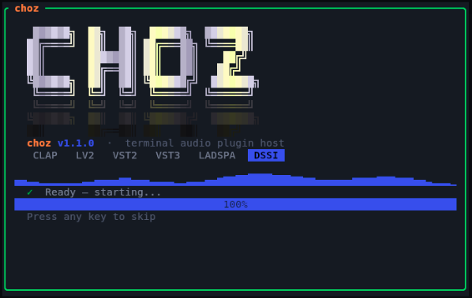
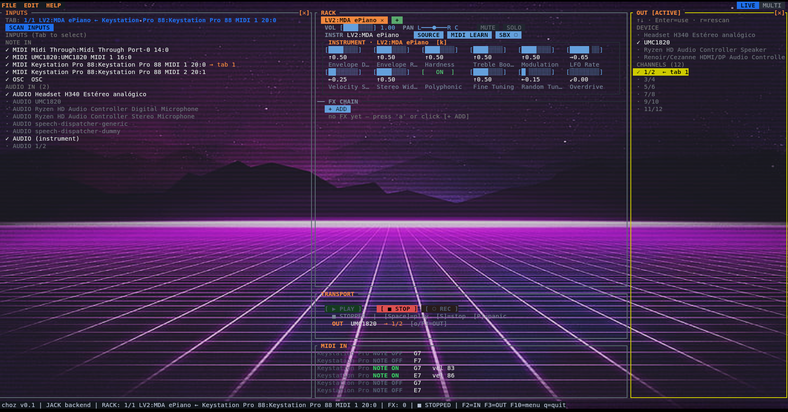

# CHOZ



A terminal-based audio plugin host for the terminal.

"Choz" can mean a few different things depending on the context:

* Tagalog Slang (Philippines): It is an informal spelling or variation of chos (from echos), meaning "just kidding," "joking," or used to brush off a statement as a joke.
* Urban/Regional Slang: In some British regional dialects, it has historically been used to mean something "good" or "brilliant".
* Spanish (Colloquial/Archaic): According to the Diccionario de la lengua española (RAE), choz can mean a sudden surprise, blow, or a state of amazement.
* Zoning (Urban Planning): It can stand for an acronym like Central Heber Overlay Zone (a specific municipal planning term).
* Toys/Media: It is frequently used as shorthand for "Cho-Z" (Super Z) series parts or spinning tops in franchises like Beyblade Burst.

Choose the meaning that suits you best!

Built with Rust, ratatui and cpal. Provides a TUI for managing note inputs, instruments and real-time FX chains.

---

## Status

**1.2.0.** The FX engine, the rack and the TUI are real and working, **CLAP, LV2,
LADSPA, DSSI, VST2, VST3 and Pure Data patches are really hosted** — instruments
and audio effects, with their own parameters and their own windows — choz's own
45 effects are published as a CLAP plugin for other hosts, and choz installs as a
`.deb`, an `.rpm` or a script, with an entry in the desktop menu.

### Plugin formats

| Format | Scan | Instrument | Effect | Native window |
|---|---|---|---|---|
| **LV2**    | ✅ | ✅ | ✅ | ✅ `ui:X11UI`, no suil |
| **VST2**   | ✅ | ✅ | ✅ | ✅ `effEditOpen` |
| **CLAP**   | ✅ | ✅ | ✅ | ✅ `clap.gui` + host timer |
| **VST3**   | ✅ | ✅ | ✅ | ✅ `IPlugView` + Linux run loop |
| **LADSPA** | ✅ | — | ✅ | ❌ (format has no GUI) |
| **DSSI**   | ✅ | ✅ | ✅ | ❌ |
| **Pure Data** | ✅ `.pd` | — | ✅ | ❌ (patch has no embeddable window) |
| **SFZ**    | ✅ | ✅ | — | — |
| **SF2**    | ✅ | ✅ (oxisynth) | — | — |

Plus **35 built-in DSP effects** — including a real-time pitch corrector — and WAV playback as a rack source.

Plugin windows embed into a real X11 window on choz's editor thread — no suil,
no Steinberg SDK. Verified by counting the parent window's actual X11 children,
not by trusting return values: **20 of 20 CLAP** and **20 of 21 VST3** plugins
installed here open at the size they ask for (Surge XT included), and **254 of
259 LV2 editors** in a full sweep with no crashes (the other 5 do not
instantiate at all — sequencers with no audio output).

Whatever a plugin's window can do, choz can do without opening it: every
parameter is a knob in the RACK, and MIDI learn binds to those knobs directly.
Parameters moved *inside* the plugin's window are followed too (VST3
`IComponentHandler`, VST2 `audioMasterAutomate`, CLAP output events, the LV2 UI
write callback), so "move that knob, then move a fader" is a complete binding.

Projects save what a parameter list cannot: the plugin's **own state** — the
patch picked in its browser — through VST2 chunks, VST3 `IComponent::getState`,
`clap.state` and LV2 `state#interface`.

---

## Build

### System dependencies

To **build** (the `-dev` headers; see below for what a *built* choz needs):

```bash
# Debian / Ubuntu
sudo apt install build-essential pkg-config libasound2-dev libjack-jackd2-dev

# Arch
sudo pacman -S base-devel alsa-lib jack2

# Fedora
sudo dnf install @development-tools alsa-lib-devel jack-audio-connection-kit-devel
```

`libjack`'s headers are what the native JACK backend is compiled against — it
works against PipeWire's JACK layer too, which is the usual setup. **No X11
headers**: the plugin windows go through `x11rb`, which speaks the protocol
itself and links no C library.

### System requirements

| | Minimum | Notes |
|---|---|---|
| **OS** | Linux with glibc | The audio backends are ALSA and JACK, and the plugin sandbox re-runs the binary per directory. No macOS or Windows build. |
| **Architecture** | x86-64, aarch64 or armv7 | Exactly what the releases ship: `x86_64-unknown-linux-gnu`, `aarch64-unknown-linux-gnu` (Pi 3/4/5), `armv7-unknown-linux-gnueabihf` (Pi 2, Zero 2 W). |
| **Audio** | ALSA (`libasound.so.2`) | Required — without it choz starts and opens no device. JACK/PipeWire is optional and `dlopen`ed. |
| **Terminal** | Any 24-bit-colour terminal | The wallpaper and logo render as halfblocks anywhere; kitty, Ghostty and WezTerm additionally get the graphics protocol. |
| **Terminal size** | 80×24 | Panels drop their optional rows as they shrink rather than breaking, but below this the rack and the monitor stop being readable together. |
| **Plugin windows** | X11 or XWayland | Only needed to *open* a plugin's own window. Every parameter is a knob in the RACK without it. |
| **Toolchain** (source only) | Rust stable, 2021 edition | Not needed for a release install. |

**Real-time privileges are optional but wanted.** choz runs without them; a
buffer small enough to play through needs them. What actually matters is
`rtprio` and `memlock` for your user — on a distribution with rtkit and
`@audio` set up, being in the `audio` group is usually the whole job:

```bash
ulimit -r -l          # want a non-zero rtprio and unlimited memlock
groups | grep audio   # the usual way to get them
```

Plugins are **native binaries**: an ARM install loads ARM plugins, not the x86
ones sitting in the same directory.

### Compile

```bash
cargo build --release
```

Every plugin host is compiled in — there are no feature flags to remember.

### What it needs at runtime

Different from what it needs to *build*. The binary links two things and opens a
third by hand:

| Library | Needed? | If missing |
|---|---|---|
| `libc` | yes | nothing runs |
| `libasound.so.2` (ALSA) | yes | choz starts but opens no audio device |
| `libjack.so.0` | **optional** — `dlopen`ed at runtime | choz uses ALSA; no JACK/PipeWire routing, no per-channel outputs |
| `libpd` (Pure Data) | **optional** — linked only by `choz-pd-host`, from `libpd-dev` (not `puredata-dev`) | choz installs and runs; Pure Data patches cannot be hosted |
| X11 | not linked | plugin windows go through `x11rb`, which speaks the protocol itself |

That is why the `.deb` declares only `libasound2t64` and `libc6`: JACK is a
runtime choice, not a build-time dependency. **The packages refuse to install
without ALSA**, and that is read off the built packages rather than intended:
`dpkg-deb -f` shows `Depends: libasound2t64 (>= 1.0.29), libc6 (>= 2.43)`, and
the `.rpm` requires `libasound.so.2()(64bit)` down to its `ALSA_0.9` symbol
versions, so `apt` and `rpm -i` both stop. JACK is a `Recommends` in both.

`install.sh` checks all three before it copies anything. **A missing ALSA stops
the install** — a choz that starts and then opens no device looks like a bug in
choz, not a missing package — and it prints the command for your distribution. A
missing JACK is only a note; a missing libpd is a note **and** it decides what
gets built: without it choz installs without the Pure Data half rather than
failing over it. `--skip-deps-check` installs anyway, which is right when you are
staging an install for a machine that is not this one.

### Install

**From a release** — no toolchain needed. Every tag publishes a `.tar.gz` per
architecture (x86-64, aarch64, armv7), a `.deb`, an `.rpm` and a `PKGBUILD` for
Arch, plus `SHA256SUMS.txt`:

```bash
tar xzf choz-1.2.0-x86_64-unknown-linux-gnu.tar.gz
cd choz-1.2.0-x86_64-unknown-linux-gnu
./install.sh            # uses the binary shipped beside it — no cargo involved
```

The tarball carries the binary, the launcher, the desktop entry, every icon size,
the MIME type, the wallpapers, choz's own effects as a CLAP plugin and the Pure
Data host — the same set the `.deb` installs. On ARM, remember that **plugins are
native binaries**: a Raspberry Pi loads plugins built for ARM, not the x86 ones.

**What an install puts down besides choz itself:**

| What | Where | Why |
|---|---|---|
| `choz.clap` | `~/.clap` (script) or `/usr/lib/clap` (packages) | choz's own 45 effects, usable from Bitwig, Reaper, Carla or any CLAP host. `--no-clap` skips it. |
| Wallpapers | `<prefix>/share/choz/wallpapers` | A fresh install opens on the image choz ships with, and the picker starts there. |
| `choz-pd-host` | next to `choz` | The only binary that links libpd — installed when libpd is present. |

**From a checkout** — the same script builds first:

```bash
./packaging/install.sh                    # build, then install into ~/.local
./packaging/install.sh --prefix /usr/local
./packaging/install.sh --binary target/release/choz   # skip the build
./packaging/install.sh --skip-deps-check   # install without checking ALSA
./packaging/install.sh --no-clap          # skip choz's effects as a CLAP plugin
./packaging/install.sh --uninstall
```

The script replaces an older copy before putting the new one down — it looks in
`~/.local/bin`, `/usr/local/bin` and `/usr/bin`, and asks each one its
`choz --version`. It also installs the desktop entry, the icon and the
`*.choz.yml` file association, so choz shows up in the menu — under multimedia,
beside the other audio applications — and a project opens with a double click.

**What no uninstall ever removes: `~/.local/state/choz`.** The projects, the
plugin paths and the settings are yours, not the package's.

For distributions, `.deb` and `.rpm` are built from the same assets and replace
the previous version by package name:

```bash
cargo build --release --bin choz          # both read target/release/choz
cargo deb -p choz-ui --no-build           # → target/debian/choz_*.deb
cargo generate-rpm -p crates/choz-ui      # → target/generate-rpm/choz-*.rpm
```

Because choz is a TUI, the desktop entry runs `choz-launcher`, which opens the
first terminal it finds — **kitty first**, since that is where the wallpaper is
drawn at real pixel resolution — at 120×40 cells. Below about 100×30 the RACK
does not fit.

---

## Run

```bash
cargo run --release --bin choz            # needs a real terminal (tty)
./target/release/choz                     # same thing, after a build
```

For live playing use the **release** binary: the debug one does not have the CPU
headroom for plugin DSP at small buffer sizes.

```bash
./target/release/choz project.yml         # open a saved project
./target/release/choz instrument.sf2      # load a file straight into a tab
./target/release/choz --osc-port 9000     # pin the OSC listener
```

### Keys to get started

| Key | Where | Action |
|---|---|---|
| `F2` / `F3` | anywhere | IN and OUT drawers (note inputs, audio devices) |
| `Enter` / `Space` | a drawer's channel row | put that channel on the active tab, or take it off (right click also takes it off) |
| `F10` | anywhere | menu bar (EDIT → Settings… → THEME) |
| `[` / `]` | rack | switch tab |
| `1` or `i` | rack | change the tab's instrument |
| `a` | rack | add an FX to the chain |
| `g` / `G` | rack | plugin window: instrument / selected FX |
| `x` / `X` | rack | run that plugin sandboxed |
| `l` | rack | MIDI learn (or click a knob after pressing `MIDI LEARN`) |
| `k` | rack | move the cursor between the instrument knobs and the FX ones |
| `p` | rack | parameters of the tab's instrument (a plugin's own list, or an SF2's reverb / chorus switches) |
| `P` | anywhere | panic — kill every sounding note |
| `F4` | anywhere | LIVE ↔ MULTI |
| `F5` | anywhere | MIDI IN panel: MIDI / WAVE / ACTIVITY (the tabs are clickable) |
| `<` `>` / `;` `:` | rack | input trim / `A→M` sensitivity of a tab fed by audio |
| `←` `→` | TRANSPORT | length of the automation loop, in bars |
| `m` / `S` | rack | mute / solo the tab |
| `c` / `r` | IN drawer | connect-disconnect a port / rescan inputs |

A controller plugged in while choz is running is picked up on its own — the port
list is polled every couple of seconds.

Log: `~/.local/state/choz/choz.log` — plugin stdout lands there too, so it never
paints over the TUI.

---

## Architecture

```
choz/                      11 crates, version 1.2.0
├── crates/
│   ├── choz-ports/         RT-safe traits every host implements: AudioSource,
│   │                       FxProcessor, PluginEditor, PluginParam, SandboxStatus
│   ├── choz-engine/        Audio thread, rack, mixer, FX chain, MIDI/OSC input,
│   │                       plugin scan cache, quarantine, sandbox policy
│   │   ├── engine.rs       RT callback, slots, EngineCommand ring
│   │   ├── jack_backend.rs Native JACK client — one port per device channel
│   │   ├── fx/             45 built-in DSP effects
│   │   ├── chord.rs        The chord being held, for the harmoniser's MIDI in
│   │   ├── feedback.rs     Catches a microphone that starts to howl
│   │   ├── maxpat.rs       Reads a Max/MSP patch and says what can be kept
│   │   ├── sources.rs      WAV, SF2 (oxisynth)
│   │   ├── sfz.rs          SFZ parser + 32-voice sampler
│   │   ├── paths.rs        Per-format search paths, Carla-style
│   │   ├── quarantine.rs   Probe a plugin in a child before trusting it
│   │   └── sandboxed.rs    AudioSource/FxProcessor that talk to a child process
│   ├── choz-plugin-clap/   CLAP host (clack-host)
│   ├── choz-plugin-lv2/    LV2 host — own Turtle parser + the C ABI, no lilv
│   ├── choz-plugin-ladspa/ LADSPA + DSSI (they share a descriptor)
│   ├── choz-plugin-vst2/   VST2 host — the published binary interface, no SDK
│   ├── choz-plugin-vst3/   VST3 host — pure-Rust COM bindings, no Steinberg SDK
│   ├── choz-plugin-pd/     Pure Data patches as effects; `choz-pd-host` is the
│   │                       only binary that links libpd (feature `pd`)
│   ├── choz-plugin-clap-export/ choz's own 45 effects, published as one `.clap`
│   ├── choz-plugin-sandbox/ Shared-memory transport for out-of-process hosting
│   │                       (audio blocks and the plugin's window)
│   └── choz-ui/            The `choz` binary: TUI, rack, modals, drawers,
│                           projects, settings, i18n, plugin windows
├── packaging/              install.sh, the desktop entry, the icon, the MIME type
├── examples/
│   └── esp32s3-touch/      A touchscreen control surface that drives choz over OSC
└── docs/
    ├── architecture.md     How the pieces fit
    ├── roadmap.md          What is still missing, and the gotchas worth knowing
    ├── audio-latency.md    PipeWire/JACK tuning and how to verify it
    └── usb-xhci-crash.md   The USB controller incident, and what avoids it
```

### Realtime contract

The audio callback allocates nothing, takes no locks, and never blocks.
Commands reach it over an `rtrb` ring; dropped objects go back over a second
ring so they are freed off the RT thread.

---

## Version

| | |
|---|---|
| choz | **1.2.0** |
| Rust edition | 2021 (`choz-plugin-lv2` is 2024) |
| Toolchain tested | rustc 1.97.1 |
| Platform | Linux. ALSA/JACK/PipeWire. Released for x86-64, aarch64 and armv7 |

See [`CHANGELOG.md`](CHANGELOG.md) for what has landed so far.

---

## Tests

```bash
cargo test --workspace              # 395 tests
cargo clippy --workspace --all-targets -- -D warnings
```

| Crate | Tests | Covers |
|---|---|---|
| `choz-engine` | 183 | 35 FX processors, mixer, sources, SFZ parser, plugin paths, scan cache, quarantine, sandbox, OSC socket |
| `choz-ui` | 163 | Rack layout, parameter controls, modals, mouse hit-testing, MIDI learn, note routing in both modes, project save/load, i18n, themes, background rendering, the installer script |
| `choz-plugin-lv2` | 16 | TTL parsing, hosting installed effects, `worker#schedule`, X11 editor discovery, state round-trip |
| `choz-plugin-clap` | 11 | Effect and instrument runtime against installed plugins, window feed |
| `choz-plugin-ladspa` | 7 | LADSPA + DSSI descriptors and runtime |
| `choz-plugin-sandbox` | 5 | Shared-memory handshake, deadline behaviour, window request |
| `choz-plugin-vst2` | 4 | Host callback transport, automation feed, runtime |
| `choz-plugin-vst3` | 5 | Factory info, parameter changes reaching the processor, run loop, runtime |

Four suites use `harness = false`, because the test binary itself has to be able
to act as a worker process: `quarantine`, `sandboxed_plugin`, `scan_isolation`
(choz-engine) and `across_a_process` (choz-plugin-sandbox).

Runtime tests run against whatever plugins are installed on the machine and skip
themselves when a format has none, so a plugin-less CI stays green.

### Long sweeps

Hosting *every* installed plugin of a format is `#[ignore]`d — it takes minutes:

```bash
cargo test --release -p choz-plugin-lv2 -- --ignored
cargo test --release -p choz-plugin-ladspa -- --ignored
```

### Diagnostic examples

Not tests — small programs that measure something against the real machine:

```bash
cargo run -p choz-plugin-lv2  --example ui_probe    # open every LV2 X11 editor
cargo run -p choz-plugin-clap --example gui_probe   # same for CLAP
cargo run -p choz-engine      --example latency_probe
cargo run -p choz-engine      --example devlist
```

---

## Environment variables

| Variable | Effect |
|---|---|
| `PIPEWIRE_LATENCY` / `PIPEWIRE_QUANTUM` | Set by choz from the configured buffer size before opening the JACK client. See [`docs/audio-latency.md`](docs/audio-latency.md). |
| `CHOZ_CLAP_STRICT_TEARDOWN=1` | Destroy CLAP plugins properly instead of leaking the ones known to crash. For debugging. |
| `CHOZ_LV2_STRICT_TEARDOWN=1` | Same for LV2 — this is how the quarantine probe finds out in the first place. |
| `CHOZ_KITTY_BG=0` | Draw the wallpaper as cell colours instead of using kitty's graphics protocol. |
| `CHOZ_SANDBOX_GUI=0` | Stop isolating a plugin just because it has a window. Cheaper, and a crashing GUI takes choz with it. |
| `CHOZ_PROBE_RUNS=N` | How many times a plugin is probed before it is believed to be safe (default 3 — some crashes are races). |
| `CHOZ_VST2_DIR=<dir>` | Extra directory for the VST2 runtime tests, where the machine's instruments live. |
| `LV2_PATH`, `VST_PATH`, `VST3_PATH`, `CLAP_PATH`, `LADSPA_PATH`, `DSSI_PATH`, `SF2_PATH`, `SFZ_PATH` | Override the search path for that format. |

State lives in `~/.local/state/choz/`: `choz.log`, `plugins.json` (scan cache),
`plugin-paths.json`, `plugin-verdicts.json`, `plugin-sandbox.json`, `ui.json`.

---
### Layout


---

## Credits

- **Jorge Codelia** — author & maintainer

---
## License

MIT — see [`LICENSE`](LICENSE).
