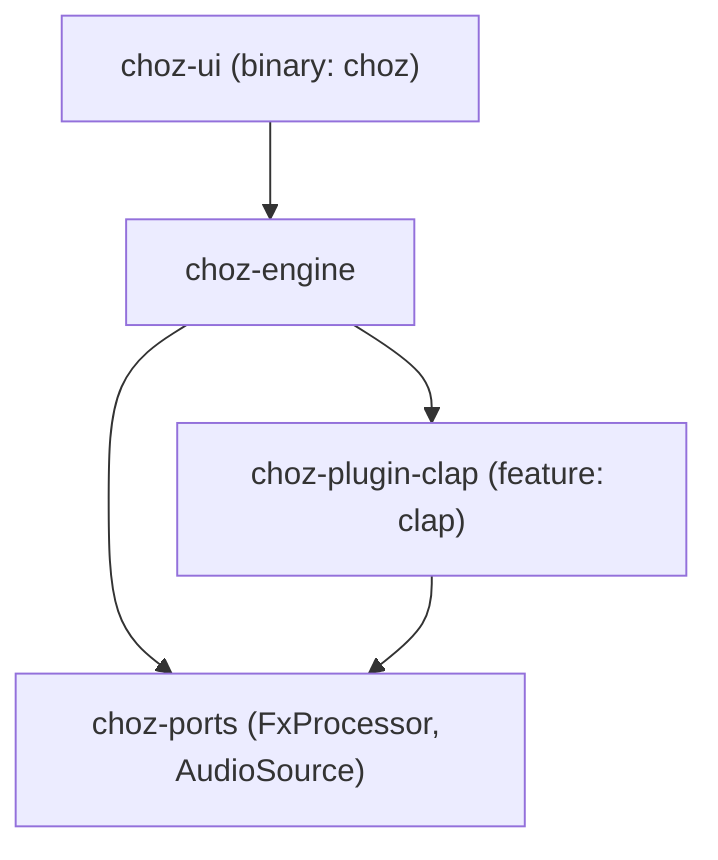
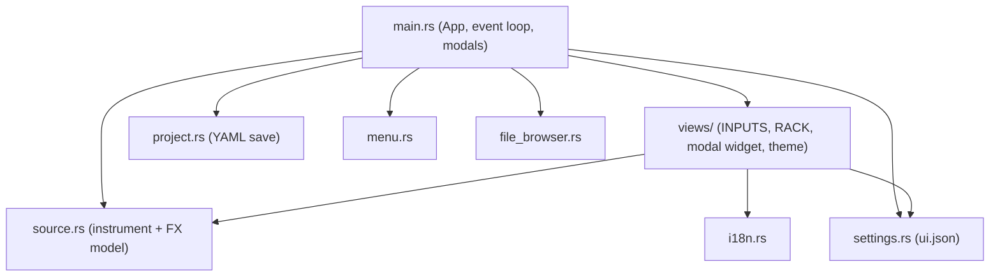
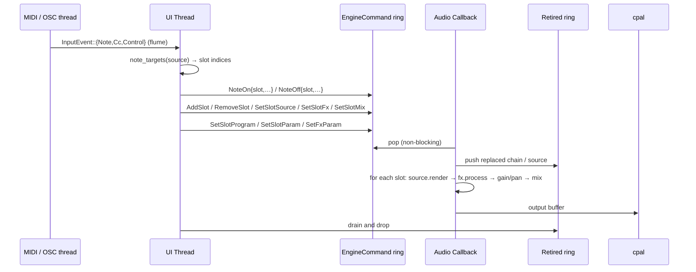
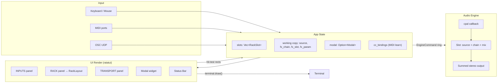
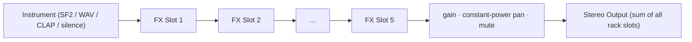
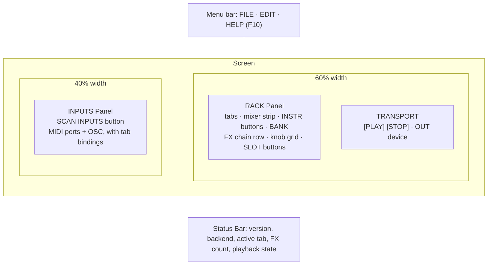
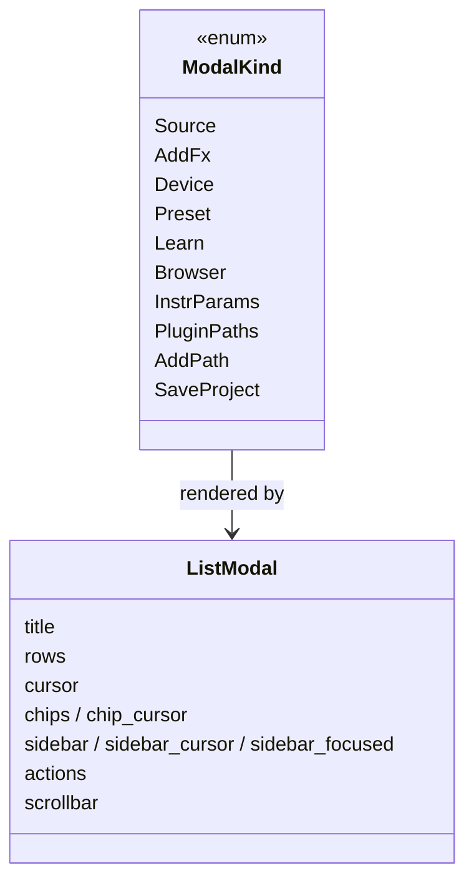
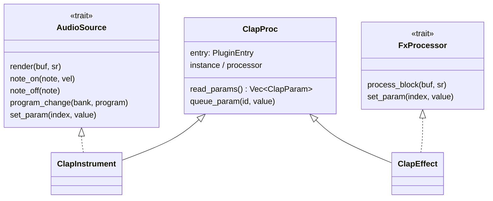

# choz Architecture

## Overview

**choz** is a terminal-based audio plugin host inspired by [Carla](https://kx.studio/Applications:Carla). It provides a TUI for managing note inputs (MIDI ports, OSC), instruments (SoundFonts, WAV files, CLAP plugins) and real-time FX chains, feeding a real-time audio engine via [cpal](https://github.com/RustAudio/cpal).

The user-facing model is:

```
[INPUT]  a MIDI port or OSC, picked in the INPUTS panel
   │  Enter binds it to a rack tab
   ▼
[RACK]   one tab (= one engine slot) per bound input
   │      · instrument: SF2 / WAV / CLAP synth      ([1:SOURCE])
   │      · mixer: gain, pan, mute, solo
   ▼
[FX]     up to 5 effects in series, built-in or CLAP
   ▼
[OUT]    the selected output device (all slots summed)
```

## Project Structure

choz is a Cargo **workspace** of four crates (modelled on seqterm's
`ports` / `engine` / `ui` layout):

- **`choz-ports`** — the realtime-safe port traits (`FxProcessor`, `AudioSource`).
  Pure trait definitions, no dependencies. Every other crate builds on it.
- **`choz-engine`** — the RT audio thread, sources, FX DSP, MIDI/OSC input, plugin
  path config and the scan cache. Depends on `choz-ports` + cpal/oxisynth/hound/midir/rosc/rtrb.
- **`choz-plugin-clap`** — CLAP plugin hosting via `clack-host`, behind the
  `clap` feature (off by default). Discovery plus instrument (`AudioSource`) and
  effect (`FxProcessor`) instances, so the engine treats a plugin like anything else.
- **`choz-ui`** — the ratatui TUI binary (`choz`). Depends on `choz-engine`.
  Its own `clap` feature forwards to `choz-engine/clap`.

```
choz/
├── Cargo.toml                    # Workspace manifest + shared dep versions
├── crates/
│   ├── choz-ports/
│   │   └── src/lib.rs            # FxProcessor + AudioSource RT traits
│   ├── choz-engine/
│   │   └── src/
│   │       ├── lib.rs           # Public re-exports (AudioEngine, FxSpec, …)
│   │       ├── engine.rs        # RT audio engine: slots, mixer, cpal callback
│   │       ├── sources.rs       # TestTone / WavPlayer / Sf2Synth (AudioSource impls)
│   │       ├── input.rs         # InputSource / NoteMsg / InputEvent
│   │       ├── midi.rs          # Hardware MIDI input (midir → flume), incl. CC
│   │       ├── osc.rs           # OSC UDP listener (notes + remote control)
│   │       ├── fx_chain.rs      # Builds FX processor chains from specs
│   │       ├── paths.rs         # PluginFormat + per-format scan dirs (Carla-style)
│   │       ├── cache.rs         # State dir + on-disk plugin scan cache
│   │       ├── registry.rs      # Legacy plugin registry (largely stub)
│   │       ├── scanner.rs       # Legacy filesystem discovery (largely stub)
│   │       ├── plugin_types.rs  # Legacy plugin format enum / host port trait
│   │       └── fx/              # 32 DSP processors (see below)
│   ├── choz-plugin-clap/
│   │   └── src/
│   │       ├── lib.rs           # Discovery + ClapPluginInfo
│   │       └── host.rs          # ClapProc, ClapInstrument, ClapEffect
│   └── choz-ui/
│       └── src/
│           ├── main.rs          # App state, event loop, UI, mouse/keyboard, modals
│           ├── source.rs        # Instrument model, AudioFxKind, FxCategory, param descs
│           ├── project.rs       # choz-project.yml save model (serde_yaml)
│           ├── settings.rs      # ui.json: color, language, audio + OSC settings
│           ├── file_browser.rs  # Filesystem browser (files and DIR_PICK mode)
│           ├── i18n.rs          # 9 languages, keys are the English strings
│           ├── menu.rs          # Menu bar: FILE / EDIT / HELP
│           ├── logo.rs          # About-dialog image
│           ├── log.rs           # ~/.local/state/choz/choz.log
│           └── views/
│               ├── mod.rs             # Shared view constants
│               ├── modal.rs           # THE modal widget (list, sidebar, chips, buttons)
│               ├── source_panel.rs    # INPUTS panel
│               ├── fx_chain_panel.rs  # RACK panel; returns its own RackLayout
│               ├── splash.rs          # Startup splash
│               └── theme.rs           # text() / border() colors from settings
```

FX processors under `crates/choz-engine/src/fx/` (32 built-ins, each with its own tests):

```
fx/
├── mod.rs          # re-exports FxProcessor + FxParam from choz-ports
├── delay.rs        # Stereo delay with ping-pong
├── gran_delay.rs   # Granular delay / pitch-shift delay
├── reverse.rs      # Reverse delay
├── space_echo.rs   # Tape-style space echo
├── reverb.rs       # Reverb
├── protocosmos.rs  # Wide ambient texture reverb
├── z5_texture.rs   # 16-parameter texture processor
├── compressor.rs   # Compressor / Limiter
├── gate.rs         # Noise gate
├── expander.rs     # Expander
├── sidechain.rs    # Sidechain ducking
├── parametric_eq.rs# 4-band parametric EQ
├── filter.rs       # State-variable filter (LP/HP/BP/Notch)
├── filterbank.rs   # Multi-band filter bank
├── isolator.rs     # 3-band isolator
├── chorus.rs       # Chorus
├── flanger.rs      # Flanger
├── phaser.rs       # Phaser
├── bitcrusher.rs   # Bitcrusher / sample-rate reducer
├── vinyl.rs        # Vinyl simulation (wow, flutter, crackle)
├── cassette.rs     # Cassette tape simulation
├── pedal.rs        # AMBER FANG + VELVET FUZZ (2x-oversampled waveshaping)
├── utility.rs      # Gain, PhaseInvert, MonoMaker, SoftClipper, TubeSaturation,
│                   # plus shared Biquad / Oversampler2x helpers
├── widener.rs      # Stereo widener
├── looper.rs       # Live looper
└── pan.rs          # Constant-power stereo panner
```

## Crate Dependency Graph



Inside `choz-ui`:



## Thread Architecture

choz runs three threads:

1. **UI thread** (main): the ratatui/crossterm event loop, keyboard and mouse
   input, all `App` state, and the *routing decision* (which slots a note reaches).
2. **Audio thread** (cpal callback): real-time, lock-free and allocation-free.
   Sums every slot (source → FX chain → gain/pan) into the output buffer.
3. **Input threads**: midir callbacks and the OSC UDP listener, both pushing
   `InputEvent`s into one `flume` channel the UI drains each frame.

Handoff to the audio thread is a **command ring** (`rtrb`), never a lock: the UI
builds chains and sources, sends them as `EngineCommand`, and anything the audio
thread replaces is pushed onto a **retire ring** so its `Drop` runs off the RT thread.



The RT thread knows nothing about MIDI ports: routing is resolved in the UI
(`fn note_targets`) so the engine only ever sees slot indices.

## Data Flow



The RACK panel computes its own hit-test rectangles and returns them as a
`RackLayout` that `ui()` stores in `UiLayout` — drawing and clicking read the
same numbers, which is what keeps them from drifting apart.

## FX Chain Processing Pipeline



`source::MAX_FX = 5` is the single source of truth for the chain length.

Each FX processor implements the `FxProcessor` trait:

```rust
pub trait FxProcessor: Send {
    fn process_block(&mut self, buf: &mut [f32], sample_rate: u32);
    fn reset(&mut self);
    fn set_mix(&mut self, wet: f32);
    fn name(&self) -> &str { "FX" }
    fn params(&self) -> Vec<FxParam> { Vec::new() }
    fn set_param(&mut self, _index: usize, _value: f32) {}
}
```

Instruments implement `AudioSource`, whose `set_param` (no-op by default) is what
lets a CLAP instrument be tweaked live, RT-safely.

Processing is zero-allocation in the audio callback — all buffers are
pre-allocated and updated in place.

## UI Layout



Knobs are laid out by `param_grid(width, n)`, which wraps onto more rows and
scrolls with the cursor, so a 16-parameter effect still fits.

## Modals

Every picker draws through one widget, `views/modal.rs`:



One `handle_modal_key` and one `handle_modal_mouse` serve all of them: wheel
scrolls, a click selects a row, a second click (or `SELECT`) confirms, a click
outside cancels. `App::close_modal()` is the only exit, which is where a changed
plugin-path list triggers a rescan.

## Plugin Architecture

Real hosting today is CLAP only, via `clack-host`:



Discovery for every other format is filesystem-only:

- `paths.rs` owns `PluginFormat {LADSPA, DSSI, LV2, VST2, VST3, CLAP, SF2, SFZ, JSFX}`
  with Carla-style default directories, honouring `LV2_PATH` / `VST_PATH` /
  `VST3_PATH` / `CLAP_PATH` / … , persisted in `<state dir>/plugin-paths.json`.
- `scan_all()` walks every enabled directory (bundles like `.lv2` / `.vst3` count
  as directories, everything else by extension) and yields `Vec<FoundPlugin>`.
- `cache.rs` writes that to `<state dir>/plugins.json` and reuses it until a scan
  directory or the path config is newer. It records `hosted: bool` so a cache
  written by a non-`clap` build is not trusted by a `clap` build.
- Formats choz cannot instantiate still appear in the pickers, marked
  `(not hosted yet)`.

`registry.rs`, `scanner.rs` and `plugin_types.rs` are the earlier, largely stubbed
plugin infrastructure; the live path is `choz-plugin-clap` + `paths.rs`. They
should be unified or deleted when LV2/VST hosting lands.

## Persistence

| File | Contents |
|------|----------|
| `<state dir>/choz.log` | Runtime log |
| `<state dir>/plugins.json` | Plugin scan cache (`Vec<FoundPlugin>` + `hosted`) |
| `<state dir>/plugin-paths.json` | Per-format scan directories |
| `<state dir>/ui.json` | Text color, language, audio settings, OSC settings |
| `choz-project.yml` | Saved project: rack + full configuration (write-only so far) |

`<state dir>` is `~/.local/state/choz` (`cache::state_dir()` is the single source
of truth; tests redirect it with `XDG_STATE_HOME`).

## Key Dependencies

| Crate | Version | Purpose |
|-------|---------|---------|
| `ratatui` | 0.29 | Terminal UI rendering |
| `crossterm` | 0.28 | Terminal control & input events |
| `ratatui-image` | 8 | About-dialog logo in the terminal |
| `cpal` | 0.15 | Cross-platform audio I/O (ALSA / JACK) |
| `jack` | 0.11 | JACK audio server bindings |
| `midir` | 0.10 | MIDI input |
| `rosc` | 0.11 | OSC message parsing |
| `oxisynth` / `soundfont` | 0.1 | SF2 synthesis and preset listing |
| `hound` | 3 | WAV decoding |
| `clack-host` / `clack-extensions` | 0.1 | CLAP hosting (feature `clap`) |
| `rtrb` | 0.3 | Lock-free ring buffers for RT handoff |
| `flume` | 0.11 | Multi-producer channels (MIDI/OSC → UI) |
| `parking_lot` | 0.12 | Fast synchronization primitives |
| `serde` / `serde_json` | 1 | Settings, caches |
| `serde_yaml` | 0.9 | Project files |
| `anyhow` | 1 | Error handling |
