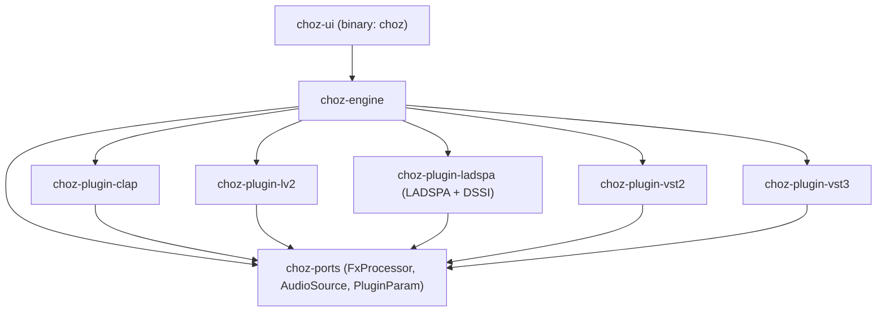
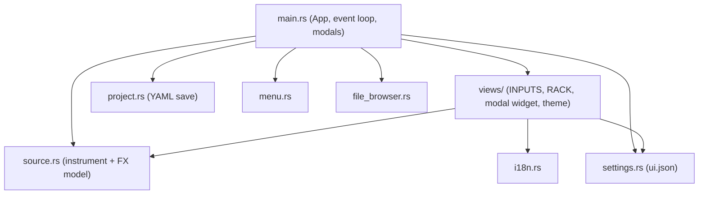
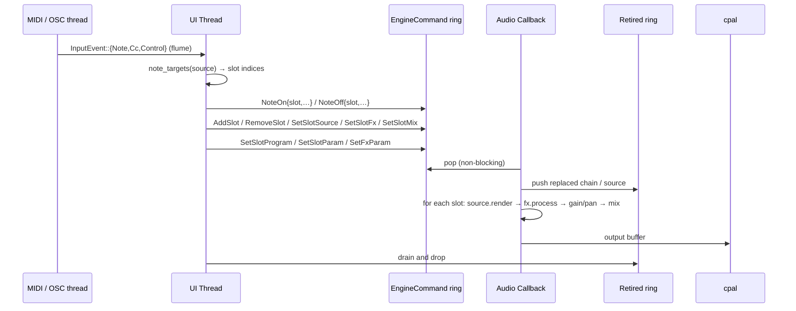
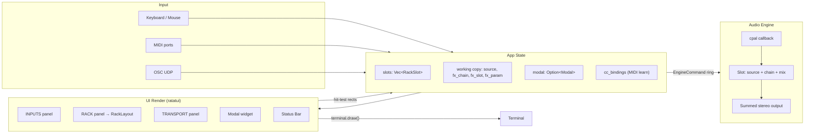
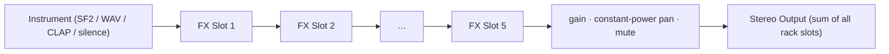
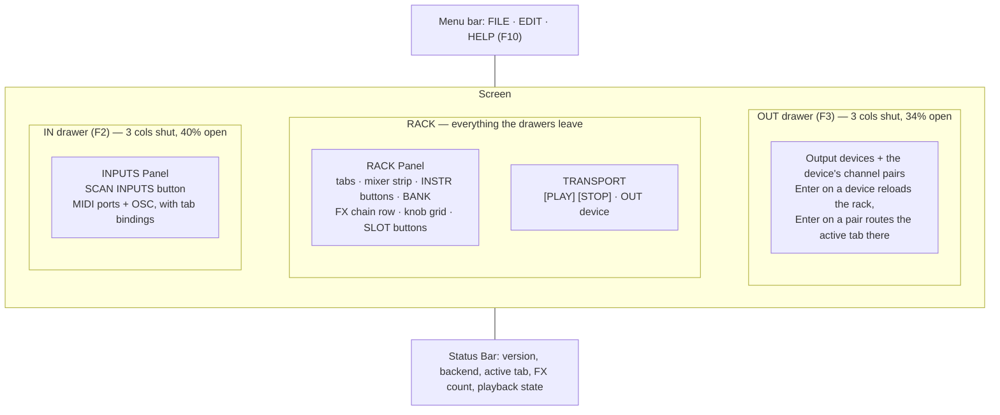
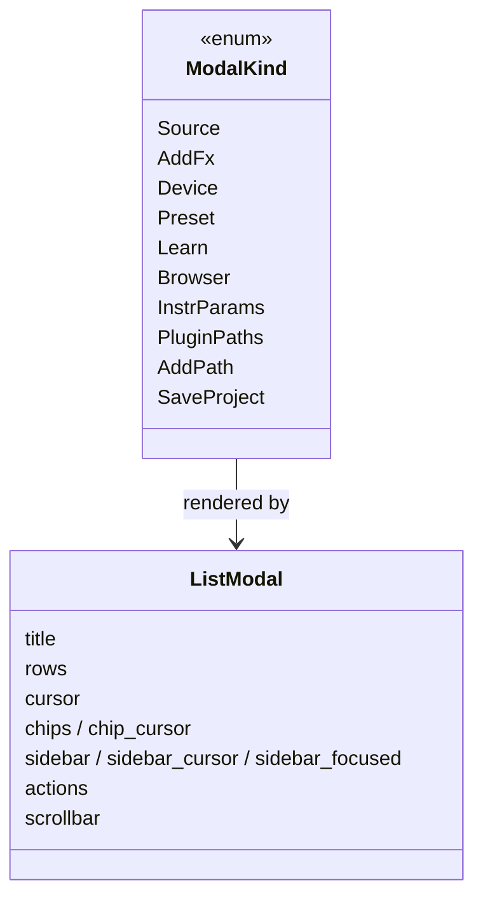
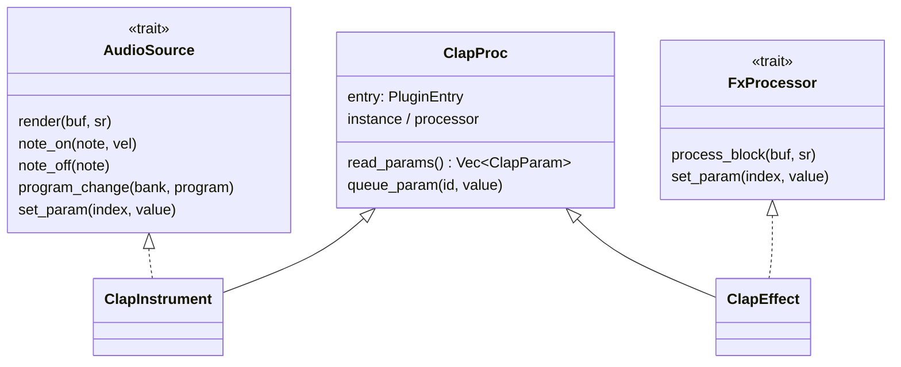

# choz Architecture

## Overview

**choz** is a terminal-based audio plugin host inspired by [Carla](https://kx.studio/Applications:Carla). It provides a TUI for managing note inputs (MIDI ports, OSC), instruments (SoundFonts, SFZ, WAV files, CLAP/LV2/LADSPA/DSSI/VST2/VST3 plugins) and real-time FX chains.

Audio reaches the device one of two ways: a **native JACK client** (`jack_backend.rs`) with one port per device channel — which is what per-slot output routing needs — falling back to [cpal](https://github.com/RustAudio/cpal) in stereo when there is no JACK graph.

The user-facing model is:

```
[INPUT]  a MIDI port or OSC, picked in the IN drawer
   │  Enter binds it to a rack tab
   ▼
[RACK]   one tab (= one engine slot) per bound input
   │      · instrument: SF2 / WAV / plugin synth    ([1:SOURCE])
   │      · mixer: gain, pan, mute, solo
   ▼
[FX]     up to 5 effects in series, built-in or plugin
   ▼
[OUT]    the selected output device (all slots summed)
```

## Project Structure

choz is a Cargo **workspace** of nine crates (modelled on seqterm's
`ports` / `engine` / `ui` layout, one crate per plugin format):

- **`choz-ports`** — the realtime-safe port traits (`FxProcessor`, `AudioSource`),
  plus `PluginEditor`, `PluginParam` and `SandboxStatus`. Pure trait definitions,
  no dependencies. Every other crate builds on it.
- **`choz-engine`** — the RT audio thread, sources, FX DSP, MIDI/OSC input, plugin
  path config and the scan cache. Depends on `choz-ports` + cpal/oxisynth/hound/midir/rosc/rtrb.
- **`choz-plugin-clap`** — CLAP hosting via `clack-host`.
- **`choz-plugin-lv2`** — LV2 hosting: the LV2 C ABI plus a pure-Rust TTL parser
  (`rio_turtle`), no lilv and no LV2 SDK.
- **`choz-plugin-ladspa`** — LADSPA and DSSI hosting (one crate: they share the
  LADSPA descriptor). DSSI synths are driven with ALSA sequencer events.
- **`choz-plugin-vst2`** — VST2 hosting through the published binary interface.
- **`choz-plugin-vst3`** — VST3 hosting through pure-Rust COM bindings (`vst3`).
  The only hosted format still without a native editor (`IPlugView` not started).
- **`choz-plugin-sandbox`** — POSIX shared memory plus the block-exchange protocol
  for running a plugin in its own process. Deliberately split in two: `shm.rs`
  maps the memory, `bridge.rs` is the protocol over those bytes and can be tested
  end to end inside one process, on a `Vec<u8>`.

  Every host crate exposes the same shape — `scan_directory`, `read_params`, an
  instrument (`AudioSource`) and an effect (`FxProcessor`) — so the engine treats
  any plugin like anything else. None of them is behind a feature flag.
- **`choz-ui`** — the ratatui TUI binary (`choz`). Depends on `choz-engine`.

```
choz/
├── Cargo.toml                    # Workspace manifest + shared dep versions
├── crates/
│   ├── choz-ports/
│   │   └── src/lib.rs            # FxProcessor + AudioSource RT traits
│   ├── choz-engine/
│   │   └── src/
│   │       ├── lib.rs           # Public re-exports (AudioEngine, FxSpec, …)
│   │       ├── engine.rs        # RT audio engine: slots, mixer, cpal callback
│   │       ├── sources.rs       # TestTone / WavPlayer / Sf2Synth (AudioSource impls)
│   │       ├── input.rs         # InputSource / NoteMsg / InputEvent
│   │       ├── midi.rs          # Hardware MIDI input (midir → flume), incl. CC
│   │       ├── osc.rs           # OSC UDP listener (notes + remote control)
│   │       ├── fx_chain.rs      # Builds FX processor chains from specs
│   │       ├── paths.rs         # PluginFormat + per-format scan dirs (Carla-style)
│   │       ├── cache.rs         # State dir + on-disk plugin scan cache
│   │       ├── jack_backend.rs  # Native JACK client: one port per device channel
│   │       ├── sfz.rs           # SFZ parser + 32-voice sampler (samples decoded on load)
│   │       ├── quarantine.rs    # Probe a plugin in a child process; cache the verdict
│   │       ├── sandboxed.rs     # AudioSource/FxProcessor backed by a child process
│   │       ├── registry.rs      # Legacy plugin registry (largely stub)
│   │       ├── scanner.rs       # Legacy filesystem discovery (largely stub)
│   │       ├── plugin_types.rs  # Legacy plugin format enum / host port trait
│   │       └── fx/              # 32 DSP processors (see below)
│   ├── choz-plugin-clap/
│   │   └── src/
│   │       ├── lib.rs           # Discovery + ClapPluginInfo
│   │       ├── host.rs          # ClapProc, ClapInstrument, ClapEffect, host extensions
│   │       └── editor.rs        # clap.gui window, ticked by the host timer
│   ├── choz-plugin-lv2/
│   │   └── src/
│   │       ├── lib.rs           # Instance, Lv2Instrument, Lv2Effect, features
│   │       ├── discovery.rs     # Bundle TTL → Lv2PluginInfo + ports
│   │       ├── ttl.rs           # Turtle/RDF graph
│   │       ├── editor.rs        # ui:X11UI window, without suil
│   │       └── lv2_abi.rs       # LV2 C structs (core, urid, atom, midi, options, ui)
│   ├── choz-plugin-ladspa/
│   │   └── src/
│   │       ├── lib.rs           # Instance, LadspaEffect, DssiInstrument
│   │       └── abi.rs           # LADSPA + DSSI + snd_seq_event_t
│   ├── choz-plugin-vst2/
│   │   └── src/
│   │       ├── lib.rs           # Instance, Vst2Effect, Vst2Instrument
│   │       └── vst2_abi.rs      # AEffect, opcodes, VstMidiEvent
│   ├── choz-plugin-vst3/
│   │   └── src/
│   │       ├── lib.rs           # Scan, Vst3Effect, Vst3Instrument
│   │       └── host.rs          # COM plumbing: component/processor/controller
│   ├── choz-plugin-sandbox/
│   │   └── src/
│   │       ├── shm.rs           # POSIX shared memory (shm_open + mmap, unlinked early)
│   │       └── bridge.rs        # The block-exchange protocol, testable on a Vec<u8>
│   └── choz-ui/
│       └── src/
│           ├── main.rs          # App state, event loop, UI, mouse/keyboard, modals
│           ├── editor.rs        # X11 window thread hosting a plugin's own GUI
│           ├── source.rs        # Instrument model, AudioFxKind, FxCategory, param descs
│           ├── project.rs       # choz-project.yml save model (serde_yaml)
│           ├── settings.rs      # ui.json: color, language, audio + OSC settings
│           ├── file_browser.rs  # Filesystem browser (files and DIR_PICK mode)
│           ├── i18n.rs          # 9 languages, keys are the English strings
│           ├── menu.rs          # Menu bar: FILE / EDIT / HELP
│           ├── logo.rs          # About-dialog image
│           ├── log.rs           # ~/.local/state/choz/choz.log
│           └── views/
│               ├── mod.rs             # Shared view constants
│               ├── modal.rs           # THE modal widget (list, sidebar, chips, buttons)
│               ├── drawer.rs          # IN/OUT drawers: handles + output routing
│               ├── source_panel.rs    # INPUTS panel (inside the IN drawer)
│               ├── fx_chain_panel.rs  # RACK panel; returns its own RackLayout
│               ├── splash.rs          # Startup splash
│               └── theme.rs           # text() / border() colors from settings
```

FX processors under `crates/choz-engine/src/fx/` (32 built-ins, each with its own tests):

```
fx/
├── mod.rs          # re-exports FxProcessor + FxParam from choz-ports
├── delay.rs        # Stereo delay with ping-pong
├── gran_delay.rs   # Granular delay / pitch-shift delay
├── reverse.rs      # Reverse delay
├── space_echo.rs   # Tape-style space echo
├── reverb.rs       # Reverb
├── protocosmos.rs  # Wide ambient texture reverb
├── z5_texture.rs   # 16-parameter texture processor
├── compressor.rs   # Compressor / Limiter
├── gate.rs         # Noise gate
├── expander.rs     # Expander
├── sidechain.rs    # Sidechain ducking
├── parametric_eq.rs# 4-band parametric EQ
├── filter.rs       # State-variable filter (LP/HP/BP/Notch)
├── filterbank.rs   # Multi-band filter bank
├── isolator.rs     # 3-band isolator
├── chorus.rs       # Chorus
├── flanger.rs      # Flanger
├── phaser.rs       # Phaser
├── bitcrusher.rs   # Bitcrusher / sample-rate reducer
├── vinyl.rs        # Vinyl simulation (wow, flutter, crackle)
├── cassette.rs     # Cassette tape simulation
├── pedal.rs        # AMBER FANG + VELVET FUZZ (2x-oversampled waveshaping)
├── utility.rs      # Gain, PhaseInvert, MonoMaker, SoftClipper, TubeSaturation,
│                   # plus shared Biquad / Oversampler2x helpers
├── widener.rs      # Stereo widener
├── looper.rs       # Live looper
└── pan.rs          # Constant-power stereo panner
```

## Crate Dependency Graph



Inside `choz-ui`:



## Thread Architecture

Three threads are always there:

1. **UI thread** (main): the ratatui/crossterm event loop, keyboard and mouse
   input, all `App` state, and the *routing decision* (which slots a note reaches).
2. **Audio thread** (JACK or cpal callback): real-time, lock-free and
   allocation-free. Sums every slot (source → FX chain → gain/pan) into the
   output buffers.
3. **Input threads**: midir callbacks and the OSC UDP listener, both pushing
   `InputEvent`s into one `flume` channel the UI drains each frame.

Three more come and go:

4. **Editor thread**, while a plugin window is open: owns the X11 connection and
   pumps the plugin's `idle()` (or its CLAP timers) every 30 ms. All X11 calls
   stay on it.
5. **Sandbox supervisor**, one per sandboxed plugin: watches the child process
   and restarts it if it dies. The audio thread never waits on it — the exchange
   has its own deadline and reads silence meanwhile.
6. **Worker processes** (not threads): scanning and load-probing re-run the choz
   binary with `--choz-scan-worker` / `--choz-probe-worker` /
   `--choz-sandbox-worker`. Every child carries `CHOZ_WORKER=1`, so a worker never
   spawns workers — that guard exists because a test binary once forked itself
   into a process bomb.

Handoff to the audio thread is a **command ring** (`rtrb`), never a lock: the UI
builds chains and sources, sends them as `EngineCommand`, and anything the audio
thread replaces is pushed onto a **retire ring** so its `Drop` runs off the RT thread.



The RT thread knows nothing about MIDI ports: routing is resolved in the UI
(`fn note_targets`) so the engine only ever sees slot indices.

## Data Flow



The RACK panel computes its own hit-test rectangles and returns them as a
`RackLayout` that `ui()` stores in `UiLayout` — drawing and clicking read the
same numbers, which is what keeps them from drifting apart.

## FX Chain Processing Pipeline



`source::MAX_FX = 5` is the single source of truth for the chain length.

Each FX processor implements the `FxProcessor` trait:

```rust
pub trait FxProcessor: Send {
    fn process_block(&mut self, buf: &mut [f32], sample_rate: u32);
    fn reset(&mut self);
    fn set_mix(&mut self, wet: f32);
    fn name(&self) -> &str { "FX" }
    fn params(&self) -> Vec<FxParam> { Vec::new() }
    fn set_param(&mut self, _index: usize, _value: f32) {}
}
```

Instruments implement `AudioSource`, whose `set_param` (no-op by default) is what
lets a CLAP instrument be tweaked live, RT-safely.

Processing is zero-allocation in the audio callback — all buffers are
pre-allocated and updated in place.

## UI Layout



Knobs are laid out by `param_grid(width, n)`, which wraps onto more rows and
scrolls with the cursor, so a 16-parameter effect still fits.

## Modals

Every picker draws through one widget, `views/modal.rs`:



One `handle_modal_key` and one `handle_modal_mouse` serve all of them: wheel
scrolls, a click selects a row, a second click (or `SELECT`) confirms, a click
outside cancels. `App::close_modal()` is the only exit, which is where a changed
plugin-path list triggers a rescan.

## Plugin Architecture

Hosted formats: CLAP, LV2, LADSPA, DSSI, VST2 and VST3 (plus SF2 soundbanks,
which are not plugins). `choz_engine::scan_all` asks each host crate for what is
in its search directories, `AudioEngine::load_plugin(slot, format, path, id)`
builds an instrument, and `fx_chain::build_plugin_fx` builds an effect. The CLAP
classes below are the pattern every host follows:



Discovery for every other format is filesystem-only:

- `paths.rs` owns `PluginFormat {LADSPA, DSSI, LV2, VST2, VST3, CLAP, SF2, SFZ}`
  with Carla-style default directories, honouring `LV2_PATH` / `VST_PATH` /
  `VST3_PATH` / `CLAP_PATH` / … , persisted in `<state dir>/plugin-paths.json`.
- `scan_all()` walks every enabled directory (bundles like `.lv2` / `.vst3` count
  as directories, everything else by extension) and yields `Vec<FoundPlugin>`.
- `cache.rs` writes that to `<state dir>/plugins.json` and reuses it until a scan
  directory or the path config is newer.
- The pickers can still mark an entry `(not hosted yet)`, but nothing triggers it
  today: every format in `PluginFormat` is hosted. The branch stays for the day a
  new one is added.

`registry.rs`, `scanner.rs` and `plugin_types.rs` are the earlier, largely stubbed
plugin infrastructure; the live path is the per-format crates plus `paths.rs`.
Unifying or deleting them is still open (see the roadmap).

### Surviving third-party code

Plugins are C libraries written by other people, and some of them crash. Three
layers, each measured against what is installed on the dev machine:

1. **Scanning is out of process.** `scan_all` spawns the choz binary itself with
   `--choz-scan-worker <FORMAT> <dir> <out>`; results come back through a file,
   because plugins print banners on stdout. If a child dies, the parent retries
   that directory one entry at a time, losing only the broken plugin.
2. **Quarantine** (`quarantine.rs`). The first time a plugin is loaded it is tried
   in a child — instantiate, two blocks, destroy — and the child records how far
   it got. `CrashesOnLoad` is refused outright; `CrashesOnTeardown` is loaded and
   then deliberately leaked, because it plays fine and only dies on the way out.
   Verdicts are cached in `<state dir>/plugin-verdicts.json`.
3. **Sandbox** (`sandboxed.rs` + `choz-plugin-sandbox`). A plugin can run in its
   own process, exchanging one block at a time over shared memory. The exchange
   has a **deadline**: if the child does not answer, the host reads silence and
   carries on, so a hung plugin costs a click rather than the stream. A supervisor
   thread restarts a child that dies. Applied automatically to whatever the probe
   saw die on teardown, and manually per plugin via the `SBX` button
   (`<state dir>/plugin-sandbox.json`).

Deny-lists remain for two cases the layers above cannot cover, both by name and
both measured: Carla's own wrappers (they corrupt the allocator rather than
crash, so there is nothing to catch) and guitarix's X11 UIs (every one of them
segfaults on instantiate).

### Native plugin windows

`choz_ports::PluginEditor` (`open(parent_xid)`, `idle`, `close`) is implemented by
whichever host can embed into an X11 window; `AudioSource` and `FxProcessor` both
expose `editor()`, defaulting to `None`. `choz-ui/src/editor.rs` owns the window:
a dedicated thread creates it with `x11rb`, hands the XID to the plugin, and
pumps `idle()` every 30 ms. One window at a time.

| Format | How |
|---|---|
| **VST2** | `effEditOpen` / `effEditGetRect` / `effEditIdle`. The `AEffect` is shared with the GUI thread under a mutex that guards *lifetime*, not audio access. |
| **LV2** | `ui:X11UI`, no suil. The UI is a separate binary that never touches the instance — it writes control values through a host callback, which is why it works with the plugin on the audio thread. |
| **CLAP** | `clap.gui` through the raw `clap_plugin` pointer (clack's safe wrapper needs a main-thread handle nobody can hold here). Needs two *host* extensions to draw at all: `clap.gui` and `clap.timer-support` — a CLAP UI paints from `on_timer`. |
| **VST3** | Not started (`IPlugView`). |

The engine captures `editor()` in `add_slot` / `set_slot_source` / `set_slot_fx`
— the only moment the UI can still touch the processor before the audio thread
takes it. Every editor holds its plugin behind an `Option` that the instance's
`Drop` empties, so a window that outlives its slot turns into a no-op instead of
calling freed memory.

## Persistence

| File | Contents |
|------|----------|
| `<state dir>/choz.log` | Runtime log |
| `<state dir>/plugins.json` | Plugin scan cache (`Vec<FoundPlugin>`) |
| `<state dir>/plugin-paths.json` | Per-format scan directories, stored by format label |
| `<state dir>/plugin-verdicts.json` | What the quarantine probe saw for each plugin |
| `<state dir>/plugin-sandbox.json` | Plugins the user pinned to run sandboxed |
| `<state dir>/ui.json` | Text color, language, audio settings, OSC settings |
| `choz-project.yml` | Saved project: rack + full configuration (saved *and* loaded) |

`<state dir>` is `~/.local/state/choz` (`cache::state_dir()` is the single source
of truth; tests redirect it with `XDG_STATE_HOME`).

## Key Dependencies

| Crate | Version | Purpose |
|-------|---------|---------|
| `ratatui` | 0.29 | Terminal UI rendering |
| `crossterm` | 0.28 | Terminal control & input events |
| `ratatui-image` | 8 | About-dialog logo in the terminal |
| `cpal` | 0.15 | Cross-platform audio I/O (ALSA / JACK) |
| `jack` | 0.11 | JACK audio server bindings |
| `midir` | 0.10 | MIDI input |
| `rosc` | 0.11 | OSC message parsing |
| `oxisynth` / `soundfont` | 0.1 | SF2 synthesis and preset listing |
| `hound` | 3 | WAV decoding |
| `clack-host` / `clack-extensions` | 0.1 | CLAP hosting (`gui` + `timer` extensions) |
| `clap-sys` | 0.5 | Raw CLAP structs — the same version clack uses |
| `libloading` | 0.8 | dlopen for the LV2 / LADSPA / VST2 hosts |
| `rio_turtle` / `rio_api` / `oxiri` | 0.8 / 0.2 | Turtle parsing for LV2 bundle TTL |
| `vst3` | 0.3 | VST3 COM bindings |
| `symphonia` | 0.5 | WAV + FLAC decoding for SFZ samples |
| `x11rb` | 0.13 | The window that hosts a plugin's native GUI |
| `rtrb` | 0.3 | Lock-free ring buffers for RT handoff |
| `flume` | 0.11 | Multi-producer channels (MIDI/OSC → UI) |
| `parking_lot` | 0.12 | Fast synchronization primitives |
| `serde` / `serde_json` | 1 | Settings, caches |
| `serde_yaml` | 0.9 | Project files |
| `anyhow` | 1 | Error handling |
