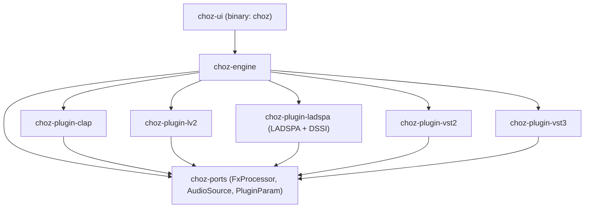
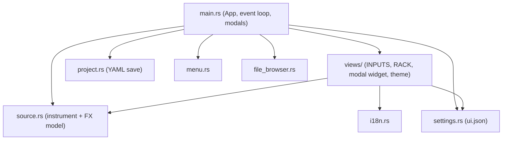
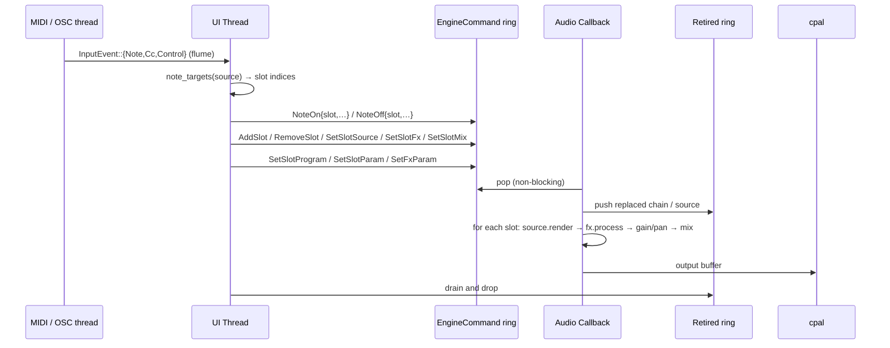
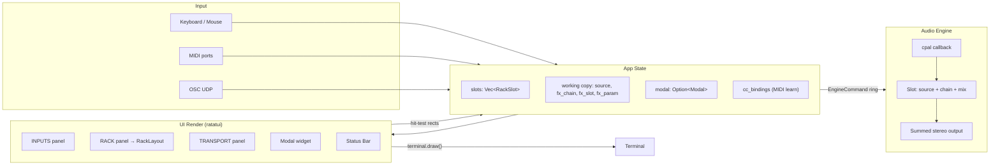
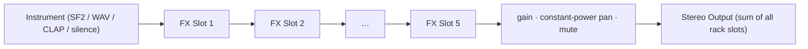
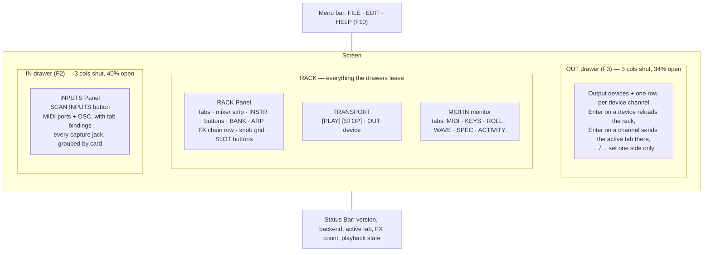
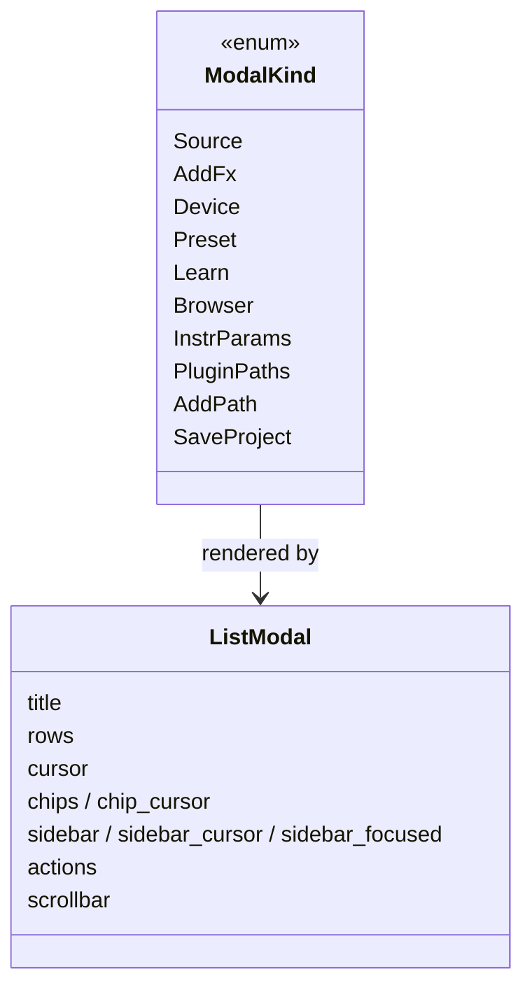
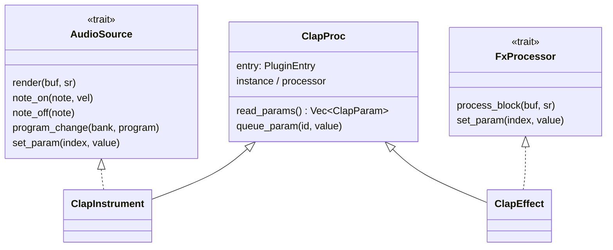

# choz Architecture

## Overview

**choz** is a terminal-based audio plugin host inspired by [Carla](https://kx.studio/Applications:Carla). It provides a TUI for managing note inputs (MIDI ports, OSC), instruments (SoundFonts, SFZ, WAV files, CLAP/LV2/LADSPA/DSSI/VST2/VST3 plugins) and real-time FX chains.

Audio reaches the device one of two ways: a **native JACK client** (`jack_backend.rs`) with one port per device channel — which is what per-slot output routing needs — falling back to [cpal](https://github.com/RustAudio/cpal) in stereo when there is no JACK graph.

The user-facing model is:

```
[INPUT]  a MIDI port or OSC, picked in the IN drawer
   │  Enter binds it to a rack tab
   ▼
[RACK]   one tab (= one engine slot) per bound input
   │      · instrument: SF2 / SFZ / WAV / plugin synth   ([1:SOURCE])
   │      · its parameters as knobs, MIDI-learnable      (INSTRUMENT box)
   │      · mixer: gain, pan, mute, solo
   ▼
[FX]     up to 5 effects in series, built-in or plugin
   ▼
[OUT]    the selected output device (all slots summed)
```

### Two modes, one switch

A switch in the top-right corner (`F4`, `settings::RackMode`) decides what a note
does, because the two jobs choz is for pull the routing in opposite directions:

| | **LIVE** | **MULTI** |
|---|---|---|
| What sounds | the active tab | every tab at once |
| What selects it | the bound input; several tabs on one port are alternatives | the **MIDI channel** each tab answers |
| Program change | selects a tab (a live rig's patch buttons) | ignored — nothing to select |
| For | playing a set on stage | being a multi-timbral module for a DAW's template |

`App::targets_for(source, channel)` is the only place that reads the mode;
`note_targets` (LIVE) and `multi_targets` (MULTI) are pure functions with tests.
Switching mode — or a tab's channel — panics first: the two routings address
different tabs, so anything held across the change would never get its note-off.

## Project Structure

choz is a Cargo **workspace** of nine crates (modelled on seqterm's
`ports` / `engine` / `ui` layout, one crate per plugin format):

- **`choz-ports`** — the realtime-safe port traits (`FxProcessor`, `AudioSource`),
  plus `PluginEditor`, `PluginParam`, `SandboxStatus` and `Transport`. Pure trait
  definitions and a handful of atomics, no dependencies. Every other crate builds
  on it.
- **`choz-engine`** — the RT audio thread, sources, FX DSP, MIDI/OSC input, plugin
  path config and the scan cache. Depends on `choz-ports` + cpal/oxisynth/hound/midir/rosc/rtrb.
- **`choz-plugin-clap`** — CLAP hosting via `clack-host`.
- **`choz-plugin-lv2`** — LV2 hosting: the LV2 C ABI plus a pure-Rust TTL parser
  (`rio_turtle`), no lilv and no LV2 SDK.
- **`choz-plugin-ladspa`** — LADSPA and DSSI hosting (one crate: they share the
  LADSPA descriptor). DSSI synths are driven with ALSA sequencer events.
- **`choz-plugin-vst2`** — VST2 hosting through the published binary interface.
- **`choz-plugin-vst3`** — VST3 hosting through pure-Rust COM bindings (`vst3`).
  Its editor needs the Linux run loop the format expects the host to provide.
- **`choz-plugin-sandbox`** — POSIX shared memory plus the block-exchange protocol
  for running a plugin in its own process. Deliberately split in two: `shm.rs`
  maps the memory, `bridge.rs` is the protocol over those bytes and can be tested
  end to end inside one process, on a `Vec<u8>`.

  Every host crate exposes the same shape — `scan_directory`, `read_params`, an
  instrument (`AudioSource`) and an effect (`FxProcessor`) — so the engine treats
  any plugin like anything else. None of them is behind a feature flag.
- **`choz-ui`** — the ratatui TUI binary (`choz`). Depends on `choz-engine`.

```
choz/
├── Cargo.toml                    # Workspace manifest + shared dep versions
├── crates/
│   ├── choz-ports/
│   │   └── src/lib.rs            # FxProcessor + AudioSource RT traits
│   ├── choz-engine/
│   │   └── src/
│   │       ├── lib.rs           # Public re-exports (AudioEngine, FxSpec, …)
│   │       ├── engine.rs        # RT audio engine: slots, mixer, cpal callback
│   │       ├── sources.rs       # TestTone / WavPlayer / Sf2Synth (AudioSource impls)
│   │       ├── input.rs         # InputSource / NoteMsg / InputEvent
│   │       ├── midi.rs          # Hardware MIDI in (midir → flume) + clock + MIDI out
│   │       ├── osc.rs           # OSC UDP listener (notes + remote control)
│   │       ├── fx_chain.rs      # Builds FX processor chains from specs
│   │       ├── pitch.rs         # Audio in → notes out (YIN), for the A→M button
│   │       ├── meter.rs         # Peak/RMS + a waveform window, for the monitor
│   │       ├── paths.rs         # PluginFormat + per-format scan dirs (Carla-style)
│   │       ├── cache.rs         # State dir + on-disk plugin scan cache
│   │       ├── jack_backend.rs  # Native JACK client: one port per device channel
│   │       ├── sfz.rs           # SFZ parser + 32-voice sampler (samples decoded on load)
│   │       ├── quarantine.rs    # Probe a plugin in a child process; cache the verdict
│   │       ├── sandboxed.rs     # AudioSource/FxProcessor backed by a child process
│   │       └── fx/              # 35 DSP processors (see below)
│   ├── choz-plugin-clap/
│   │   └── src/
│   │       ├── lib.rs           # Discovery + ClapPluginInfo
│   │       ├── host.rs          # ClapProc, ClapInstrument, ClapEffect, host extensions
│   │       └── editor.rs        # clap.gui window, ticked by the host timer
│   ├── choz-plugin-lv2/
│   │   └── src/
│   │       ├── lib.rs           # Instance, Lv2Instrument, Lv2Effect, features
│   │       ├── discovery.rs     # Bundle TTL → Lv2PluginInfo + ports
│   │       ├── ttl.rs           # Turtle/RDF graph
│   │       ├── editor.rs        # ui:X11UI window, without suil
│   │       └── lv2_abi.rs       # LV2 C structs (core, urid, atom, midi, options, ui)
│   ├── choz-plugin-ladspa/
│   │   └── src/
│   │       ├── lib.rs           # Instance, LadspaEffect, DssiInstrument
│   │       └── abi.rs           # LADSPA + DSSI + snd_seq_event_t
│   ├── choz-plugin-vst2/
│   │   └── src/
│   │       ├── lib.rs           # Instance, Vst2Effect, Vst2Instrument
│   │       └── vst2_abi.rs      # AEffect, opcodes, VstMidiEvent
│   ├── choz-plugin-vst3/
│   │   └── src/
│   │       ├── lib.rs           # Scan, Vst3Effect, Vst3Instrument
│   │       └── host.rs          # COM plumbing: component/processor/controller
│   ├── choz-plugin-sandbox/
│   │   └── src/
│   │       ├── shm.rs           # POSIX shared memory (shm_open + mmap, unlinked early)
│   │       └── bridge.rs        # The block-exchange protocol, testable on a Vec<u8>
│   └── choz-ui/
│       └── src/
│           ├── main.rs          # App state, event loop, UI, mouse/keyboard, modals
│           ├── editor.rs        # X11 window thread hosting a plugin's own GUI
│           ├── source.rs        # Instrument model, AudioFxKind, FxCategory, param descs
│           ├── project.rs       # choz-project.yml save model (serde_yaml)
│           ├── arp.rs           # Per-tab arpeggiator + step sequencer (one clock)
│           ├── automation.rs    # Lanes against the beat, addressed like MIDI learn
│           ├── settings.rs      # ui.json: color, language, audio + OSC settings
│           ├── file_browser.rs  # Filesystem browser (files and DIR_PICK mode)
│           ├── i18n.rs          # 9 languages, keys are the English strings
│           ├── menu.rs          # Menu bar: FILE / EDIT / HELP
│           ├── logo.rs          # About-dialog image
│           ├── log.rs           # ~/.local/state/choz/choz.log
│           └── views/
│               ├── mod.rs             # Shared view constants
│               ├── modal.rs           # THE modal widget (list, sidebar, chips, buttons)
│               ├── drawer.rs          # IN/OUT drawers: handles + output routing
│               ├── source_panel.rs    # INPUTS panel (inside the IN drawer)
│               ├── fx_chain_panel.rs  # RACK panel; returns its own RackLayout
│               ├── splash.rs          # Startup splash
│               ├── midi_monitor.rs    # Tabs: MIDI / KEYS / ROLL / WAVE / ACTIVITY
│               ├── background.rs      # Desktop: flat colour or image, in cells
│               ├── kitty_bg.rs        # The same image at real pixel resolution,
│               │                      # under the cell backgrounds (kitty et al)
│               └── theme.rs           # Colours, and the wash panels blend with
```

FX processors under `crates/choz-engine/src/fx/` (35 built-ins, each with its own tests):

```
fx/
├── mod.rs          # re-exports FxProcessor + FxParam from choz-ports
├── delay.rs        # Stereo delay with ping-pong
├── gran_delay.rs   # Granular delay / pitch-shift delay
├── reverse.rs      # Reverse delay
├── space_echo.rs   # Tape-style space echo
├── reverb.rs       # Reverb
├── protocosmos.rs  # Wide ambient texture reverb
├── z5_texture.rs   # 16-parameter texture processor
├── compressor.rs   # Compressor / Limiter
├── gate.rs         # Noise gate
├── expander.rs     # Expander
├── sidechain.rs    # Sidechain ducking
├── parametric_eq.rs# 4-band parametric EQ
├── graphic_eq.rs   # 10-band Winamp graphic EQ + its 18 presets (from tanu)
├── autotune/       # Real-time pitch correction — see docs/autotune.md
│   ├── detector.rs   # YIN at 16 kHz: F0, confidence, voiced
│   ├── quantizer.rs  # Hz → note → the note it should have been (key + scale)
│   ├── corrector.rs  # Retune speed, correction, humanise → a pitch ratio
│   ├── shifter.rs    # PSOLA: pitch without time, formants for free
│   ├── formant.rs    # …and the switch that gives them up on purpose
│   └── meter.rs      # What it heard, for the readout under the knobs
├── filter.rs       # State-variable filter (LP/HP/BP/Notch)
├── filterbank.rs   # Multi-band filter bank
├── isolator.rs     # 3-band isolator
├── chorus.rs       # Chorus
├── flanger.rs      # Flanger
├── phaser.rs       # Phaser
├── bitcrusher.rs   # Bitcrusher / sample-rate reducer
├── vinyl.rs        # Vinyl simulation (wow, flutter, crackle)
├── cassette.rs     # Cassette tape simulation
├── pedal.rs        # AMBER FANG + VELVET FUZZ (2x-oversampled waveshaping)
├── saturator.rs    # The general waveshaper: 8 curves, bias, tone, 1x–8x
├── oversample.rs   # Reusable 1x/2x/4x/8x oversampling + a log tone control
├── smooth.rs       # One-pole parameter smoothing, sample-rate aware
├── utility.rs      # Gain, PhaseInvert, MonoMaker, SoftClipper, TubeSaturation,
│                   # plus shared Biquad / Oversampler2x helpers
├── widener.rs      # Stereo widener
├── looper.rs       # Live looper
└── pan.rs          # Constant-power stereo panner
```

### Shared DSP pieces

Two things every nonlinear effect needs, so neither belongs to one of them:

- **`oversample.rs`** — a waveshaper multiplies harmonic content, and whatever
  it makes above Nyquist folds back down as inharmonic tones. Running the curve
  at 2×, 4× or 8× and filtering before decimating throws that away instead.
  Each halving stage carries a **4th-order** Butterworth: with two poles the
  first reflection is barely 10 dB down and cascading stages hits a floor set by
  the filter rather than by the factor — measured, 8× went from 15 % of the
  aliasing to under 10 %. The factor is a parameter, not a policy: it is worth
  it for a hard clipper and pure waste for anything linear.
- **`smooth.rs`** — a knob is set between blocks and read every sample; the step
  between the two is a click. One pole, so there is no corner. It snaps to the
  target once the gap drops below 1e-5, because in `f32` the recursion reaches a
  fixed point while still that far away.

## Crate Dependency Graph



Inside `choz-ui`:



## Thread Architecture

Three threads are always there:

1. **UI thread** (main): the ratatui/crossterm event loop, keyboard and mouse
   input, all `App` state, and the *routing decision* (which slots a note reaches).
2. **Audio thread** (JACK or cpal callback): real-time, lock-free and
   allocation-free. Sums every slot (source → FX chain → gain/pan) into the
   output buffers.
3. **Input threads**: midir callbacks and the OSC UDP listener, both pushing
   `InputEvent`s into one `flume` channel the UI drains each frame.

Three more come and go:

4. **Editor thread**, while a plugin window is open: owns the X11 connection and
   pumps the plugin's `idle()` (or its CLAP timers) every 30 ms. All X11 calls
   stay on it.
5. **Sandbox supervisor**, one per sandboxed plugin: watches the child process
   and restarts it if it dies. The audio thread never waits on it — the exchange
   has its own deadline and reads silence meanwhile.
6. **Worker processes** (not threads): scanning and load-probing re-run the choz
   binary with `--choz-scan-worker` / `--choz-probe-worker` /
   `--choz-sandbox-worker`. Every child carries `CHOZ_WORKER=1`, so a worker never
   spawns workers — that guard exists because a test binary once forked itself
   into a process bomb.

Handoff to the audio thread is a **command ring** (`rtrb`), never a lock: the UI
builds chains and sources, sends them as `EngineCommand`, and anything the audio
thread replaces is pushed onto a **retire ring** so its `Drop` runs off the RT thread.



The RT thread knows nothing about MIDI ports: routing is resolved in the UI
(`fn note_targets`) so the engine only ever sees slot indices.

## Data Flow



The RACK panel computes its own hit-test rectangles and returns them as a
`RackLayout` that `ui()` stores in `UiLayout` — drawing and clicking read the
same numbers, which is what keeps them from drifting apart.

**A note-off follows its note-on.** Routing depends on which tab is active, so
`App.sounding` remembers where each note was sent and the release goes there,
however the rack changed meanwhile. `PANIC` (`EngineCommand::Panic`) is the way
out when a note is stuck anyway: each engine slot keeps a `u128` of the notes it
was told to play and gets a real note-off for every one of them, then the
`all_notes_off()` broadcast — the note-offs are what a VST3 plugin actually
receives, since *all notes off* is a MIDI CC.

### Routing is per channel, not per pair

A tab's input and output are `(usize, usize)` — two device channels picked
independently, not an index into a list of stereo pairs. The engine has always
read them that way (`mix[l]`, `mix[r]`, `capture[l]`, `capture[r]`, each clamped
to the last channel); only the drawers used to offer `2n`/`2n+1`, which is what
made an interface look like a stack of stereo pairs it is not.

Both drawers list **one row per channel**, labelled with what it is to the active
tab (`L`, `R`, `L+R`), and channels go on and off one at a time: `Enter`/`Space`
toggles, the left button assigns, the right button unassigns.

`assign_channel` and `unassign_channel` are the whole rule, both pure functions
with tests. Assigning is a **queue of two**: the newcomer is the right side and
the oldest falls off the left. That is not a detail — a tab starts on 1 and 2,
so pinning the left instead would leave channel 1 in the routing however many
times the user clicked. As it is, clicking 3 then 9 gives exactly 3 and 9.

Unassigning the last channel of an input returns `None`, which is the tab back on
its instrument — the same state the `(instrument)` row sets. An output has no
such state (the engine needs a channel to mix into), so that gesture does
nothing.

### Where the inputs come from

Live audio has **two shapes**, and `AudioEngine::input_ports()` hides the
difference from the UI: it always answers "one name per input channel", and the
drawer groups its rows by the part before the colon.

*On the native JACK client*, `jack_backend::all_capture_ports()` returns **every**
capture port in the graph, grouped by owning node, and the client registers one
input port per entry and wires them one for one. There is no device to choose:
the user picks a *channel*.

*On ALSA / PulseAudio / PipeWire* (the cpal backends) there is no graph to wire,
so choz opens a capture **device** — chosen in `EDIT → Settings → AUDIO →
Input`, remembered in `ui.json` as `audio.input_device`, and off until asked
for. Its channels are the input channels.

The two backends differ in one more way that matters: JACK hands playback and
capture to the *same* callback, so the backend fills `RtState::capture`
directly. cpal gives them their own devices and their own callbacks on their own
clocks, so the input stream pushes into a lock-free ring (`RtState::capture_rx`)
and `drain_capture` empties one block of it at the top of the output callback.
That drain answers for both ends of the drift: short fills with silence, long
throws the backlog away — a ring allowed to fill is latency that grows all night
and never comes back.

This replaced asking the *sink* for its capture ports, which is what choz used to
do — and on PipeWire an interface is two nodes, so an eight-input UMC1820
reported `AUDIO IN (0)` and the rows were simply not there. Nothing about the
engine changed: `in_pair` was always a pair of capture indices.

**A rack tab has two ways to be born**, and it used to have one: binding a note
input (`bind_selected_input`), or now assigning an audio channel — both go
through `ensure_slot`. Only the first existed, so a guitarist with no MIDI port
to bind had an empty rack and every assignment landed on a slot that was not
there: the rows drew, the clicks did nothing.

`ponytail:` a slot's `in_pair` indexes that flat list, so unplugging a card
shifts what a saved project points at. Names in the project would fix it; a
rescan is the honest workaround until someone hits it.

### Where the notes go

A tab's notes end at its own instrument, and — when the OUT drawer's `MIDI OUT`
section has one bound — at a **MIDI port** as well. That is the destination the
arpeggiator is for: a desk of hardware with no arpeggiator of its own.

Everything goes through `App::send_note`: the keys, the arpeggiator's own
events, and the note-offs `PANIC` sends. A second destination that some paths
know about and others do not is a synth left droning by whichever path was
forgotten, so there is exactly one funnel.

`midi::MidiOut` keeps the list of what it has sounding and stops it note by note
rather than with CC 123 — a hardware synth that ignores "all notes off" drones
until it is power-cycled, and the list of what is actually down is right there.
Connections are **shared by port name** (`App.midi_outs`): ALSA hands a port to
one client, so two tabs pointed at the same synth have to be one connection. The
tab stores the **name**, not an index: ports come and go, and an index into a
list that changed while choz was closed points at somebody else's synth.

### The clock, from outside

`midi.rs` counts MIDI clock **inside the port's own callback**, which is the last
place the timestamp is honest — a pulse read from the UI loop carries that
loop's jitter. Twenty-four pulses is a quarter, so a quarter of them is one
`ClockMsg::Tempo`: averaging over the beat rather than over one interval, which
carries every bit of jitter the cable and the sender have between them. The
pulse that closes a quarter opens the next one, or every reading would lose a
beat.

`START` rewinds and rolls, `CONTINUE` rolls from where it stopped, `STOP` stops.
The tempo is written straight to the transport: the sender **is** the clock, and
smoothing it here would put choz a beat behind whatever it is playing with. The
`CLK INT/EXT` switch in the TRANSPORT panel is what turns any of this on, and it
is a switch on purpose — a port that sends clock all day would otherwise take
the tempo over the moment it is plugged in.

### Audio in, notes out (`A→M`)

A tab fed by a capture pair normally passes that audio through its FX. With `A→M`
on (`RackButton::PitchToMidi`, only offered where there *is* an input) the audio
is listened to instead: `pitch::PitchTracker` reads the block the callback
already has and the slot's own instrument plays what it heard, so a guitar drives
Surge XT like a keyboard would.

- **Monophonic, and that is the honest limit, not a shortcut.** One period is one
  frequency; a chord has several and picking one is a guess. Guitar synths have
  worked this way — one string, one converter — for forty years.
- **What it costs is the whole design.** The first version ran YIN at the
  device's rate on every block — 872 lags over 2048 samples, 187 times a second,
  inside the audio callback. That is ~340M operations a second for one guitar,
  and it did not read as "late": it read as **random notes**, because the
  callback was missing its deadline and the plugin was being starved. Decimating
  to ~16 kHz (a box average is both the downsample and its anti-alias filter)
  and analysing on an 8 ms hop instead of per block is ~30× less work. A note
  cannot start twice inside a hop, so nothing is lost.
- **YIN, not plain autocorrelation.** A squared difference alone dips at every
  short lag on a smooth signal, and the first version duly reported a guitar's
  low E an octave and a half up. Dividing each lag by the running mean of the
  ones before it leaves the real period as the first dip under the threshold.
- **A pitch has to hold before it becomes a note** (three analyses, ~24 ms):
  while the window still holds the previous note the detector walks up a
  semitone at a time, and without this a slide fired eight note-ons instead of
  two. A note change also asks for a cleaner reading than a note start does.
- **The conversion is Csound's `ftom` with `irnd` non-zero** — rounded to the
  nearest integer. One jack in, one note out. `freq_to_note_exact` is the
  `irnd = 0` form and exists so the *deviation* can be shown; only the rounded
  note is ever played.
- **Rounding alone is not enough, and this is the part to get right.** A pitch
  resting on a semitone boundary rounds up and down as it wobbles, and each flip
  would be a note-on. A note changes only when the new one is `HYSTERESIS`
  (20 cents) past the halfway point *and* has held for `STEADY_ANALYSES`. A
  singer's vibrato is one note held; a real semitone is a new note.
- **The input is one jack.** A tab on a single channel has the same signal both
  sides; a tab on two different channels has two different microphones, and
  summing those is phase cancellation plus two pitches at once. The tracker
  reads the left side — the channel assigned first.
- **The reading is published** (`meter::pitch_meter()`), and the `A→M` button
  draws it: the note and its cents, or the input level when nothing sounds. The
  cents are a display only — the plugin gets the note, exactly.
  Without it a tracker that hears nothing and one that hears the wrong thing are
  indistinguishable from the outside, and `SENS` has nothing to aim at.
- **`A→M` drives the tab's instrument, not its FX chain.** A tab with no
  instrument tracks perfectly and has nothing to play, so the rack says which of
  the two is happening.
- The tracker lives in the `Slot`, so it is per tab and touched only from the
  audio thread. Switching it off releases whatever was sounding — the toggle must
  not leave a note hanging.
- **The gate is a control, not a constant** (`SENS` on the mixer strip). A
  single-coil through an amp has a noise floor a synthetic test tone does not,
  and the level that means "a note" is the player's decision. It rides on the
  same command as the input trim (`SetSlotInTrim`), because both are answers to
  the same question: how loud is what is coming in.

### What the output sounds like (`meter.rs`)

The audio callback is the only place that sees the mixed signal and can neither
allocate nor block, so it publishes a handful of atomics — peak, RMS and a
decimated waveform ring — and the UI reads them when it redraws. Relaxed
ordering throughout: a meter one block stale is a meter that is right. The MIDI
monitor's **WAVE** and **ACTIVITY** tabs (`F5`, or click the strip) are just two
drawings of that, next to the messages, because "did the note arrive" and "did
anything come out" are the same question asked twice.

The **KEYS** and **ROLL** tabs answer the first question with a picture instead
of a log. `KeyboardState` (in `midi_monitor.rs`) is a 128-slot map of what is
held plus a fixed ring of recent notes for the falling view, fed from
`drain_midi` **after** routing is resolved, so a key can be coloured by the tab
that is playing it (`KeyColor::{Channel, Instrument, Velocity}`, saved in
`ui.json`). It is deliberately not `App.sounding`: that one indexes slots and
exists so a note-off reaches the tab its note-on went to, and merging the two is
how notes get stuck. There is no stuck-note timeout either — a held pad is a
held note; `PANIC` is what clears both the rack and the picture.

## FX Chain Processing Pipeline



`source::MAX_FX = 12` is the single source of truth for the chain length.

Each FX processor implements the `FxProcessor` trait:

```rust
pub trait FxProcessor: Send {
    fn process_block(&mut self, buf: &mut [f32], sample_rate: u32);
    fn reset(&mut self);
    fn set_mix(&mut self, wet: f32);
    fn name(&self) -> &str { "FX" }
    fn params(&self) -> Vec<FxParam> { Vec::new() }
    fn set_param(&mut self, _index: usize, _value: f32) {}
}
```

Instruments implement `AudioSource`, whose `set_param` (no-op by default) is what
lets a CLAP instrument be tweaked live, RT-safely.

Processing is zero-allocation in the audio callback — all buffers are
pre-allocated and updated in place.

### Rules every built-in effect follows

Not style, law — an effect that breaks one of these breaks the audio thread for
everything else in the rack:

- no allocations, locks, I/O or logging inside `process_block`;
- sample-rate aware, and re-derived when the rate changes under it;
- parameters smoothed wherever a jump would click;
- deterministic, unless randomness is part of the effect — and then from a
  fixed seed, so a session repeats and a test can exist;
- `reset()` that leaves nothing behind;
- output bounded: an effect that can run away takes the mix bus with it, so a
  feedback loop is bounded **structurally** (a saturator) and not by a constant
  someone measured once.

The test pattern each one follows: silence, an impulse, a sine, noise, mono and
stereo, both ends of every parameter, a sample-rate change, tiny and huge
blocks, automation, and NaN/Inf — plus whatever that effect specifically claims
(attenuation for an EQ, gain reduction over threshold for a compressor, the
delay time measured off an impulse, decay for a reverb).

### Pitch, and the two shifters

There are two pitch shifters and that is deliberate.
`autotune::shifter::RetuneShifter` cuts its jumps on a **detected period**,
which is what makes a corrector clean on a voice at ratios near 1 — it needs a
detector behind it. `fx::shift::VoiceShifter` takes any ratio and needs
nothing, paying for it with a light warble; it is what the shimmer's feedback
loop and the harmoniser's voices share. Two shifters for two jobs, one
implementation of each.

`pitch::PitchTracker` (`A→M`) runs **inside the audio callback**, so what it
costs comes out of the same budget as the instrument and the whole FX chain —
and a callback that misses its deadline glitches the **graph**, not just choz.
It is band-limited at both ends before it measures (60 Hz high-pass under the
lowest note, 3.5 kHz low-pass before decimating), and its inner loop reads two
plain slices rather than walking a ring. There is an `#[ignore]`d test that
measures what one block costs; run it when the detector is touched.

### Measurement

`choz-engine::meter` publishes what the output sounds like: peak, RMS, a
decimated waveform window, and an **undecimated** ring (`SPECTRUM_POINTS`) for
anything that measures frequency. The FFT that reads it lives in
`choz-ui::spectrum` and runs on the **UI thread** — the callback writes samples
and nothing else.

## UI Layout



Knobs are laid out by `param_grid(width, n)`, which wraps onto more rows and
scrolls with the cursor, so a 16-parameter effect still fits.

**A click rect is never a hand-computed offset.** Every panel returns the
rectangles it drew (`RackLayout`, `ModalRects`, the monitor's tab strip) and the
mouse router only ever consults those. The rule has a specific reason: the text
before a button can be translated, so `inner.x + 2 + 8` is right in English and
wrong in Spanish — which is how the bank arrows ended up answering one column to
the left of where they were painted. Positions are accumulated from the widths
of the spans actually pushed (`Span::width`, not `chars().count()`, which lies
about CJK).

## Modals

Every picker draws through one widget, `views/modal.rs`:



One `handle_modal_key` and one `handle_modal_mouse` serve all of them: wheel
scrolls, a click selects a row, a second click (or `SELECT`) confirms, a click
outside cancels. `App::close_modal()` is the only exit, which is where a changed
plugin-path list triggers a rescan.

## Plugin Architecture

Hosted formats: CLAP, LV2, LADSPA, DSSI, VST2 and VST3 (plus SF2 soundbanks,
which are not plugins). `choz_engine::scan_all` asks each host crate for what is
in its search directories, `AudioEngine::load_plugin(slot, format, path, id)`
builds an instrument, and `fx_chain::build_plugin_fx` builds an effect. The CLAP
classes below are the pattern every host follows:



Discovery for every other format is filesystem-only:

- `paths.rs` owns `PluginFormat {LADSPA, DSSI, LV2, VST2, VST3, CLAP, SF2, SFZ}`
  with Carla-style default directories, honouring `LV2_PATH` / `VST_PATH` /
  `VST3_PATH` / `CLAP_PATH` / … , persisted in `<state dir>/plugin-paths.json`.
- `scan_all()` walks every enabled directory (bundles like `.lv2` / `.vst3` count
  as directories, everything else by extension) and yields `Vec<FoundPlugin>`.
- `cache.rs` writes that to `<state dir>/plugins.json` and reuses it until a scan
  directory or the path config is newer.
- The pickers can still mark an entry `(not hosted yet)`, but nothing triggers it
  today: every format in `PluginFormat` is hosted. The branch stays for the day a
  new one is added.

There is one plugin path and it is this one: the per-format crates plus
`paths.rs`. The earlier `registry.rs` / `scanner.rs` / `plugin_types.rs` — 563
lines of stubs behind `#[allow(dead_code)]`, reached only by a field nothing
read — were deleted rather than unified.

### Surviving third-party code

Plugins are C libraries written by other people, and some of them crash. Three
layers, each measured against what is installed on the dev machine:

1. **Scanning is out of process.** `scan_all` spawns the choz binary itself with
   `--choz-scan-worker <FORMAT> <dir> <out>`; results come back through a file,
   because plugins print banners on stdout. If a child dies, the parent retries
   that directory one entry at a time, losing only the broken plugin.
2. **Quarantine** (`quarantine.rs`). The first time a plugin is loaded it is tried
   in a child — instantiate, two blocks, destroy — and the child records how far
   it got. `CrashesOnLoad` is refused outright; `CrashesOnTeardown` is loaded and
   then deliberately leaked, because it plays fine and only dies on the way out.
   The child also reports **whether the plugin has a window** — it asks for the
   editor handle, it never opens one — and both halves are cached together in
   `<state dir>/plugin-verdicts.json`.
3. **Sandbox** (`sandboxed.rs` + `choz-plugin-sandbox`). A plugin can run in its
   own process, exchanging one block at a time over shared memory. The exchange
   has a **deadline**: if the child does not answer, the host reads silence and
   carries on, so a hung plugin costs a click rather than the stream. A supervisor
   thread restarts a child that dies. Applied to whatever the probe saw die on
   teardown, to anything the user pins with the `SBX` button
   (`<state dir>/plugin-sandbox.json`), and **to every plugin that has a window**:
   plugin GUIs are the least trustworthy code choz runs, and the sandbox is the
   only place where one that dies costs a process instead of the app.
   `CHOZ_SANDBOX_GUI=0` turns that last reason off.

Deny-lists remain for two cases the layers above cannot cover, both by name and
both measured: Carla's own wrappers (they corrupt the allocator rather than
crash, so there is nothing to catch) and guitarix's X11 UIs — a sweep of every
installed editor killed nine slices of twenty, all nine on a `gx_*`. **The UI
deny-list belongs to the process, not to the plugin**: `allow_denied_uis(true)`
lifts it, and the only places that call it are the sandbox child and the probe,
both of which can afford to die.

### Native plugin windows

`choz_ports::PluginEditor` (`open(parent_xid)`, `idle`, `close`) is implemented by
whichever host can embed into an X11 window; `AudioSource` and `FxProcessor` both
expose `editor()`, defaulting to `None`. `choz-ui/src/editor.rs` owns the window:
a dedicated thread creates it with `x11rb`, hands the XID to the plugin, and
pumps `idle()` every 30 ms. One window at a time.

| Format | How |
|---|---|
| **VST2** | `effEditOpen` / `effEditGetRect` / `effEditIdle`. The `AEffect` is shared with the GUI thread under a mutex that guards *lifetime*, not audio access. |
| **LV2** | `ui:X11UI`, no suil. The UI is a separate binary that never touches the instance — it writes control values through a host callback, which is why it works with the plugin on the audio thread. |
| **CLAP** | `clap.gui` through the raw `clap_plugin` pointer (clack's safe wrapper needs a main-thread handle nobody can hold here). Needs two *host* extensions to draw at all: `clap.gui` and `clap.timer-support` — a CLAP UI paints from `on_timer`. |
| **VST3** | `IPlugView`, plus the part Linux needs: a VST3 plugin gets no idle callback — it registers timers and file descriptors on the host's `Steinberg::Linux::IRunLoop`, which it finds by querying the `IPlugFrame` it was given. `HostFrame` is both. |
| **Sandboxed** | The window is opened **by the child process**, embedded into an X11 window choz created — window ids are valid across processes. A GUI that crashes takes the child down, and the supervisor replaces it. |

The engine captures `editor()` in `add_slot` / `set_slot_source` / `set_slot_fx`
— the only moment the UI can still touch the processor before the audio thread
takes it. Every editor holds its plugin behind an `Option` that the instance's
`Drop` empties, so a window that outlives its slot turns into a no-op instead of
calling freed memory. `param_touch()` and `state()` are captured at the same
moment, for the same reason.

### Parameters, without opening a window

The RACK draws the tab's instrument parameters (`draw_knob_box`, shared with the
FX chain's). They are clickable, they are MIDI-learn targets, and the values are
what the project saves — so a CC can be bound to any parameter of any plugin
without waiting for its GUI to build.

**Which control each one gets comes from the plugin, never from its name.**
`PluginParam` carries `steps` (0 continuous, 2 a switch, n an enumeration), `unit`
and `points` — the named steps with the place each sits at — filled by each host
from what its format reports: `lv2:portProperty`/`lv2:scalePoint`/`units:unit`,
VST3's `stepCount` + `getParamStringByValue` + `units`, CLAP's `IS_STEPPED` +
`value_to_text`, LADSPA's `TOGGLED`/`INTEGER` hints. VST2 reports none of it and
stays continuous. `source::ParamShape` turns that into the control:

| Report | Control |
|---|---|
| `steps == 2` | switch in the RACK, checkbox in the long list |
| every step named | `◀ Sine ▶` with `k/n` under it |
| unit is a time or a percentage | horizontal fader |
| three or more of those in a row sharing a unit | a bank of vertical bars (`fader_groups`) |
| anything else | the arc, at eight positions per cell |

Two things this must keep, and there are tests for both: a stepped parameter
moves **one position** per arrow or wheel click (`ParamShape::nudge`), and every
control — bank bars included — keeps its own rect in `RackLayout.instr_knobs`,
which is what the mouse and MIDI learn work off.

The named positions carry the value they sit at, not an index: Ardour's `a-delay`
names ten note divisions over a range of 1..48, so a uniform grid would show the
wrong name and step to values the plugin never offered.

### The transport

`choz_ports::transport()` is one clock — position in frames, tempo, sample rate,
play state — as atomics, advanced by the audio callback in `AudioEngine::render`
and by nothing else. It is process-global on purpose: there is one clock, and the
place that needs it most is VST2's `audioMasterGetTime`, a C callback handed a
plugin pointer and no host context at all.

Four formats read it, each in its own units: VST2 fills `VstTimeInfo` on every
ask, VST3 gets a `ProcessContext` per block (it used to get `NULL`, which means
"the host has no idea what time it is"), CLAP gets a transport event, and LV2 is
handed a `time:Position` object written into its atom port. Only what choz knows
is flagged valid — a plugin reads a field when its flag says it is there — so
there is no cycle and no SMPTE. Tempo and time signature are Settings → AUDIO,
applied live and saved in `ui.json`.

**Bars are offered, and they are the phase rather than a place.** `bar_position()`
reads the time signature in quarter notes — 4/4 is four, 6/8 is three, 7/8 is
three and a half — and counts from the last transport reset, because choz has no
arrangement to number bars against. A plugin syncing a pattern to bar starts
needs the phase, and the phase is true; "bar 1 forever" was not, which is why
this used to be withheld.

When the GUI *is* open, choz follows it: `choz_ports::ParamTouch` reports the
parameter the user just grabbed **inside the plugin's window**, translated to the
index choz addresses knobs by. Each format has its own channel for this — VST3
`IComponentHandler::performEdit`, VST2 `audioMasterAutomate`, CLAP's output event
stream (read on the audio thread, `try_lock`, never blocking), the LV2 UI's write
callback — and `App::poll_plugin_touch` turns it into either a learn target or an
updated value.

### The plugin's own state

Parameter values do not describe a patch. `choz_ports::PluginState` carries the
opaque blob each format has for that — VST2 chunks, VST3 `IComponent::getState`,
`clap.state`, LV2 `state#interface` — and the project stores it as base64. On
rebuild the patch is restored **first** and the knob values applied on top:
restoring state moves every parameter, so the other order would leave a tab
sounding like the patch and looking like the knobs.

### The desktop, and why it is two paths

A terminal cell background is **opaque**, which decides everything here:

- **Everywhere**: the image is reduced to cell colours and written into the
  buffer (`background.rs`, halfblocks — two pixels per cell). Panels then blend
  the theme's colour with what the picture shows *at that cell*, so they read as
  translucent (`theme::wash`).
- **kitty and friends**: the image is handed to the terminal at the window's real
  pixel size and placed **below the cell backgrounds** (`z < -1073741824`), so it
  keeps every pixel it had. Panels cannot wash it by painting cells — that would
  cover it — so the wash is a **second, translucent image** over the first, four
  pixels per cell and re-sent only when the layout or the opacity changes.
- **A flat colour**: there is no picture to blend cell by cell, so the wash is
  resolved **once per frame** into a single colour (`theme::panel_fill`) that
  every panel paints. Without this a flat desktop left the panels painting
  nothing at all, and a section was indistinguishable from the space around it.

`theme::blend(base, tint, alpha)` is the one place "semi transparent" exists —
a cell background has no alpha, so it has to become a real colour before it is
painted. Every section goes through the same two settings, so they wash
identically: **Panel colour** (the scheme's own by default, or any palette
entry) and **Panel opacity**. Neither is offered on the terminal's own
background: choz cannot read that colour, and a translucency it cannot compute
would be a setting that lies.

Because the opacity lives in the panels and not in the image, moving it costs a
redraw rather than a decode and a transfer.

## Persistence

| File | Contents |
|------|----------|
| `<state dir>/choz.log` | Runtime log |
| `<state dir>/plugins.json` | Plugin scan cache (`Vec<FoundPlugin>`) |
| `<state dir>/plugin-paths.json` | Per-format scan directories, stored by format label |
| `<state dir>/plugin-verdicts.json` | What the quarantine probe saw for each plugin |
| `<state dir>/plugin-sandbox.json` | Plugins the user pinned to run sandboxed |
| `<state dir>/ui.json` | Theme colours, desktop background and its panel opacity, language, audio + OSC settings, LIVE/MULTI |
| `choz-project.yml` | Saved project: rack (instruments, their state blobs, FX chains, mixer, MIDI channel, learn bindings) + full configuration |

`<state dir>` is `~/.local/state/choz` (`cache::state_dir()` is the single source
of truth; tests redirect it with `XDG_STATE_HOME`).

## Packaging and the desktop

`packaging/` holds everything that turns a build into something installed:
`install.sh` (finds an older copy in `~/.local/bin`, `/usr/local/bin` and
`/usr/bin`, asks it `choz --version`, removes it, then installs; in a release
tarball it uses the **binary shipped beside it** rather than building — the
person who downloaded a `.tar.gz` is exactly the one without a toolchain), the
`.desktop`
entry, the `hicolor` icon and the `application/x-choz-project` MIME type for
`*.choz.yml`. `.deb` and `.rpm` metadata live in `crates/choz-ui/Cargo.toml` and
install the same files; both replace the previous version by package name.

Two things about that metadata are easy to get wrong and impossible to see:

- **The `assets` list belongs in `[package.metadata.deb]`, never in a variant.**
  A variant inherits from the base table, not the other way round. With the list
  inside `variants.arm` the ordinary x86_64 package built cleanly, installed
  cleanly, and contained the binary and the copyright — no desktop entry, no
  icon, no launcher, and therefore no menu entry. Nothing warns. `dpkg-deb -c`
  on the built package is the only way to see it, so
  `crates/choz-ui/tests/packaging_assets.rs` reads the manifest instead and
  fails if a destination or a source goes missing.
- **The binary's source path is `target/release/choz`, not `../../target/…`.**
  Only the first spelling is recognised as the Cargo target directory, and only
  a recognised one is rewritten under `--target` — with the other form an arm64
  package was built around the *host* binary. Every other asset is relative to
  the manifest, as cargo-deb expects.

After unpacking, `postinst` refreshes the desktop, MIME and icon caches (and
`postrm` again on removal), which `install.sh` does too. Debian ships triggers
that usually handle this; "usually" is how an application installs and never
appears in the menu.

**Nothing an uninstall touches lives in `~/.local/state/choz`** — the projects,
the plugin paths and the settings are the user's, not the package's, and there is
a test that proves it.

choz is a TUI, so the desktop entry runs `choz-launcher` rather than the binary:
it opens the first terminal it finds — **kitty first**, because that is where the
wallpaper is drawn at real pixel resolution — at 120×40 cells, below which the
RACK does not fit. `Cross.toml` carries the ALSA/JACK headers the Raspberry Pi
targets need; without it the cross build dies in `alsa-sys` before compiling a
line of choz.

`examples/esp32s3-touch/` is the other end of the same idea: an ESP32-S3 with a
touchscreen cannot host plugins (no MMU, no `dlopen`, no Linux for it), but it
makes a good surface — faders, mutes and keys over OSC to the port choz already
listens on, with no choz-side change at all.

## Key Dependencies

| Crate | Version | Purpose |
|-------|---------|---------|
| `ratatui` | 0.29 | Terminal UI rendering |
| `crossterm` | 0.28 | Terminal control & input events |
| `ratatui-image` | 8 | About-dialog logo in the terminal |
| `cpal` | 0.15 | Cross-platform audio I/O (ALSA / JACK) |
| `jack` | 0.11 | JACK audio server bindings |
| `midir` | 0.10 | MIDI input and output |
| `rosc` | 0.11 | OSC message parsing |
| `oxisynth` / `soundfont` | 0.1 | SF2 synthesis and preset listing |
| `hound` | 3 | WAV decoding |
| `clack-host` / `clack-extensions` | 0.1 | CLAP hosting (`gui` + `timer` extensions) |
| `clap-sys` | 0.5 | Raw CLAP structs — the same version clack uses |
| `libloading` | 0.8 | dlopen for the LV2 / LADSPA / VST2 hosts |
| `rio_turtle` / `rio_api` / `oxiri` | 0.8 / 0.2 | Turtle parsing for LV2 bundle TTL |
| `vst3` | 0.3 | VST3 COM bindings |
| `symphonia` | 0.5 | WAV + FLAC decoding for SFZ samples |
| `x11rb` | 0.13 | The window that hosts a plugin's native GUI |
| `rtrb` | 0.3 | Lock-free ring buffers for RT handoff |
| `flume` | 0.11 | Multi-producer channels (MIDI/OSC → UI) |
| `parking_lot` | 0.12 | Fast synchronization primitives |
| `serde` / `serde_json` | 1 | Settings, caches |
| `serde_yaml` | 0.9 | Project files |
| `anyhow` | 1 | Error handling |
