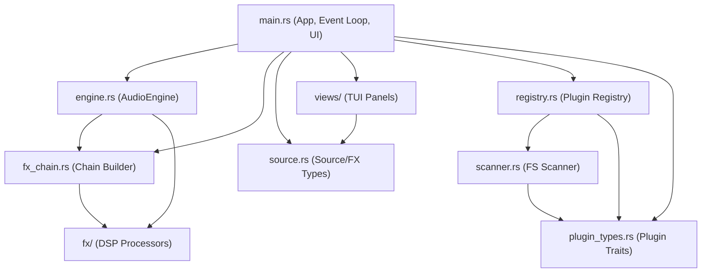
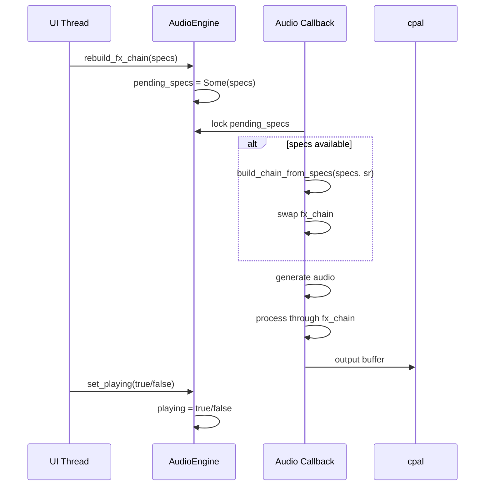
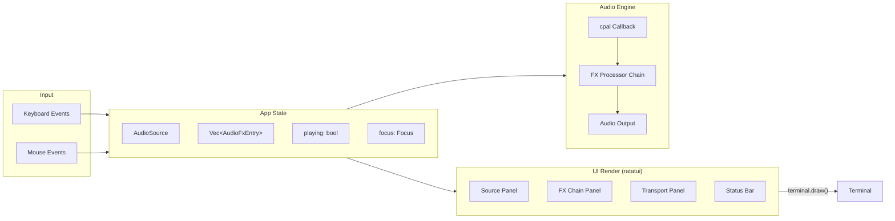
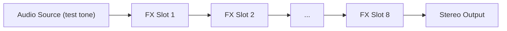
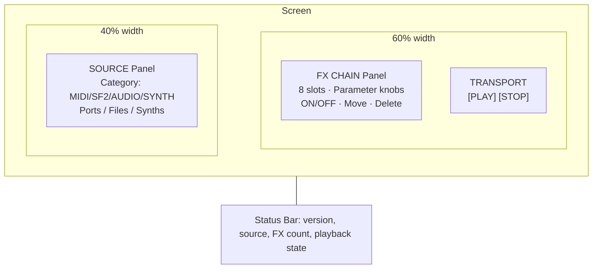
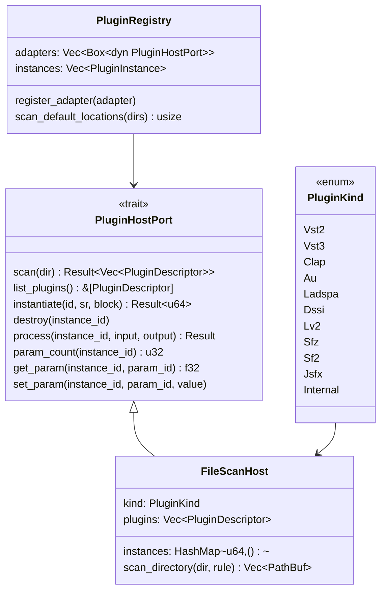

# choz Architecture

## Overview

**choz** is a terminal-based audio plugin host inspired by [Carla](https://kx.studio/Applications:Carla). It provides a TUI for managing audio sources (MIDI, SoundFonts, audio files, synthesizer plugins) and real-time FX chains, feeding a real-time audio engine via [cpal](https://github.com/RustAudio/cpal).

## Project Structure

choz is a Cargo **workspace** of three crates (modelled on seqterm's
`ports` / `engine` / `ui` layout):

- **`choz-ports`** — the realtime-safe port traits (`FxProcessor`, `AudioSource`).
  Pure trait definitions, no dependencies. Both other crates build on it.
- **`choz-engine`** — the RT audio thread, sources, FX DSP, MIDI input, and the
  plugin registry. Depends on `choz-ports` + cpal/oxisynth/hound/midir/rtrb.
- **`choz-plugin-clap`** — CLAP plugin hosting via `clack-host`, behind the
  `clap` feature (off by default). Discovery + instrument instances that
  implement `AudioSource`, so the engine plays a loaded plugin like any source.
- **`choz-ui`** — the ratatui TUI binary (`choz`). Depends on `choz-engine`.
  Its own `clap` feature forwards to `choz-engine/clap`.

```
choz/
├── Cargo.toml                    # Workspace manifest + shared dep versions
├── crates/
│   ├── choz-ports/
│   │   └── src/lib.rs            # FxProcessor + AudioSource RT traits
│   ├── choz-engine/
│   │   └── src/
│   │       ├── lib.rs           # Public re-exports (AudioEngine, FxSpec, …)
│   │       ├── engine.rs        # Real-time audio engine (cpal callback thread)
│   │       ├── sources.rs       # TestTone / WavPlayer / Sf2Synth (AudioSource impls)
│   │       ├── midi.rs          # Hardware MIDI input (midir → flume)
│   │       ├── fx_chain.rs      # Builds FX processor chains from specs
│   │       ├── registry.rs      # Plugin registry — unified plugin lifecycle
│   │       ├── scanner.rs       # Filesystem discovery for LADSPA/DSSI/SFZ/SF2/JSFX
│   │       ├── plugin_types.rs  # Plugin format enum, descriptor, host port trait
│   │       └── fx/              # 27 DSP processors (see below)
│   └── choz-ui/
│       └── src/
│           ├── main.rs          # App state, event loop, UI, mouse/keyboard input
│           ├── source.rs        # Source-selection model, FX kind enum, param descriptors
│           ├── file_browser.rs  # WAV/SF2 file browser modal
│           └── views/
│               ├── mod.rs          # Re-exports SOURCE_CATEGORIES and FX_CELL_W
│               ├── source_panel.rs # SOURCE selection panel (MIDI/SF2/AUDIO/SYNTH)
│               └── fx_chain_panel.rs # FX chain panel (slots, knobs, routing)
```

FX processors under `crates/choz-engine/src/fx/`:

```
fx/
├── mod.rs          # re-exports FxProcessor + FxParam from choz-ports
├── delay.rs        # Stereo delay with ping-pong
├── reverb.rs       # Reverb
├── compressor.rs   # Compressor / Limiter
├── gate.rs         # Noise gate
├── expander.rs     # Expander
├── parametric_eq.rs# 4-band parametric EQ
├── filter.rs       # State-variable filter (LP/HP/BP/Notch)
├── filterbank.rs   # Multi-band filter bank
├── chorus.rs       # Chorus
├── flanger.rs      # Flanger
├── phaser.rs       # Phaser
├── bitcrusher.rs   # Bitcrusher / sample-rate reducer
├── vinyl.rs        # Vinyl simulation (wow, flutter, crackle)
├── cassette.rs     # Cassette tape simulation
├── utility.rs      # Gain, PhaseInvert, MonoMaker, SoftClipper, TubeSaturation
├── widener.rs      # Stereo widener
├── isolator.rs     # 3-band isolator
├── looper.rs       # Live looper
├── gran_delay.rs   # Granular delay / pitch-shift delay
├── sidechain.rs    # Sidechain ducking
└── pan.rs          # Stereo panner
```

## Module Dependency Graph



## Thread Architecture

choz uses two threads:

1. **UI thread** (main): Runs the ratatui/crossterm event loop at ~20 FPS, reads keyboard and mouse input, mutates `App` state.
2. **Audio thread** (cpal callback): Runs in real-time with fixed buffer size (default: 256 samples at 48 kHz). Generates audio and processes through the FX chain.

Communication between threads uses `Arc<Mutex<T>>` shared state:



## Data Flow



## FX Chain Processing Pipeline



Each FX processor implements the `FxProcessor` trait:

```rust
pub trait FxProcessor: Send {
    fn process_block(&mut self, buf: &mut [f32], sample_rate: u32);
    fn reset(&mut self);
    fn set_mix(&mut self, wet: f32);
    fn name(&self) -> &str { "FX" }
    fn params(&self) -> Vec<FxParam> { Vec::new() }
    fn set_param(&mut self, _index: usize, _value: f32) {}
}
```

Processing is zero-allocation in the audio callback — all buffers are pre-allocated and updated in-place.

## UI Layout



## Mouse Interaction Map

| Region | Action | Result |
|--------|--------|--------|
| Panel area | Left click | Set keyboard focus to that panel |
| Source category tabs | Left click | Select source category (MIDI/SF2/AUDIO/SYNTH) |
| FX slot button | Left click | Select FX slot, display its parameters |
| Parameter knob area | Left click | Select parameter |
| Parameter knob area | Scroll up/down | Adjust parameter value ±0.03 |
| `[+ ADD]` button | Left click | Open FX kind selector modal |
| `ON`/`OFF` button | Left click | Toggle selected FX enabled/disabled |
| `<-MOVE` button | Left click | Move FX one slot left |
| `MOVE->` button | Left click | Move FX one slot right |
| `DEL` button | Left click | Delete selected FX |
| Transport `[SPACE]` | Left click | Toggle play/stop |
| Transport `[S] STOP` | Left click | Stop playback |
| FX selector item | Left click | Select FX kind to add |
| Outside FX selector | Left click | Dismiss modal |

## Plugin Architecture

The plugin system uses a registry-adapter pattern:



## Key Dependencies

| Crate | Version | Purpose |
|-------|---------|---------|
| `ratatui` | 0.29 | Terminal UI rendering |
| `crossterm` | 0.28 | Terminal control & input events |
| `cpal` | 0.15 | Cross-platform audio I/O |
| `jack` | 0.11 | JACK audio server bindings |
| `midir` | 0.10 | MIDI I/O |
| `libloading` | 0.8 | Dynamic library loading for plugins |
| `serde` / `serde_json` | 1 | Configuration serialization |
| `parking_lot` | 0.12 | Fast synchronization primitives |
| `flume` | 0.11 | Multi-producer channels |
| `tracing` / `tracing-subscriber` | 0.1 / 0.3 | Structured logging |
| `anyhow` / `thiserror` | 1 / 2 | Error handling |
| `directories` | 5 | Standard config/data directories |
